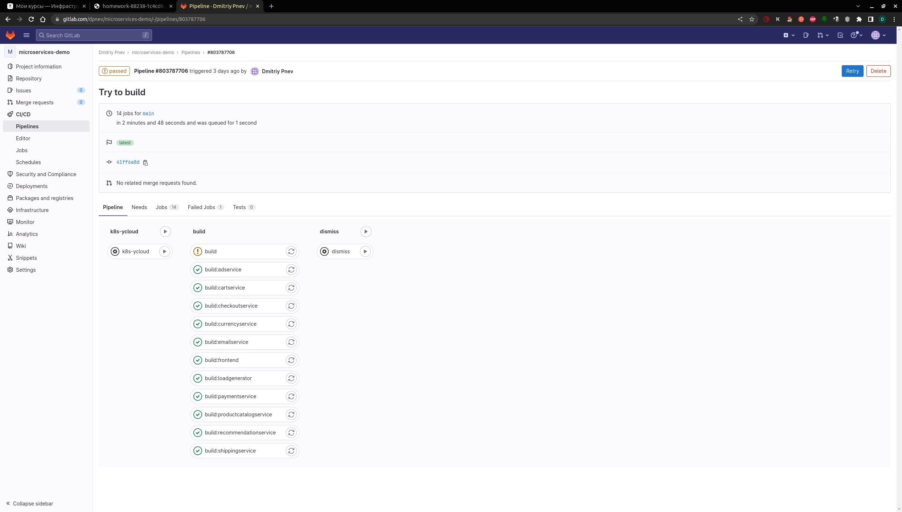
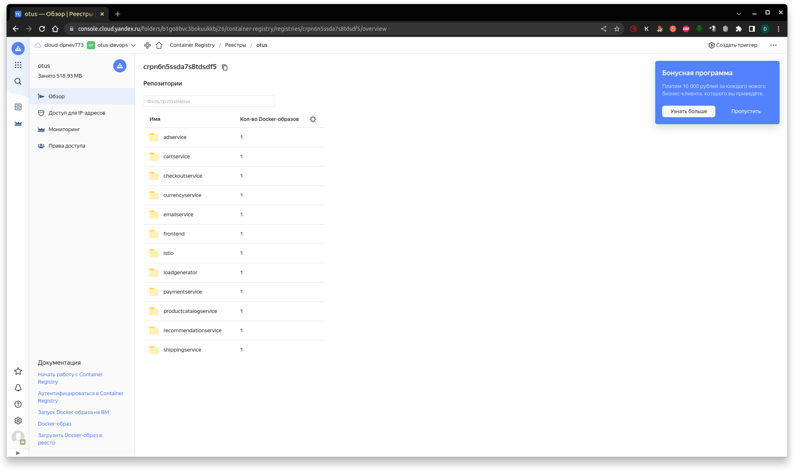
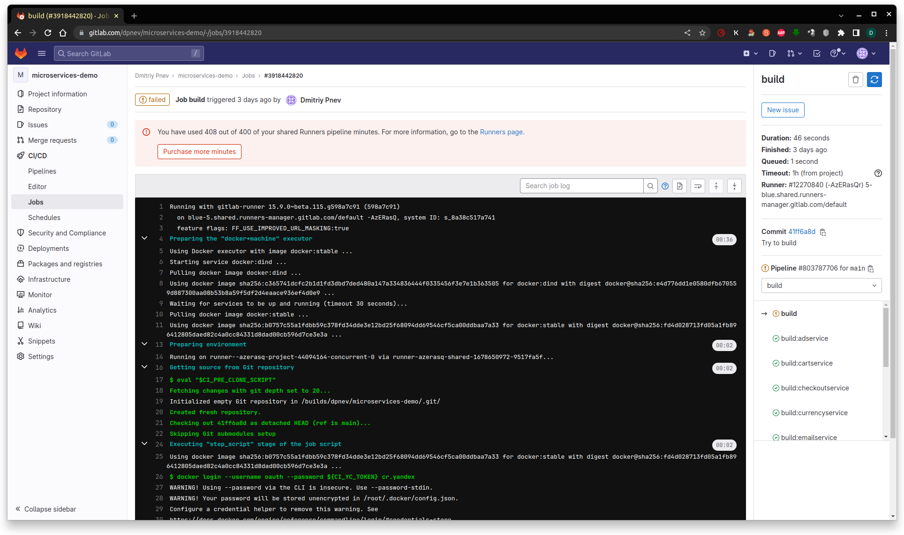
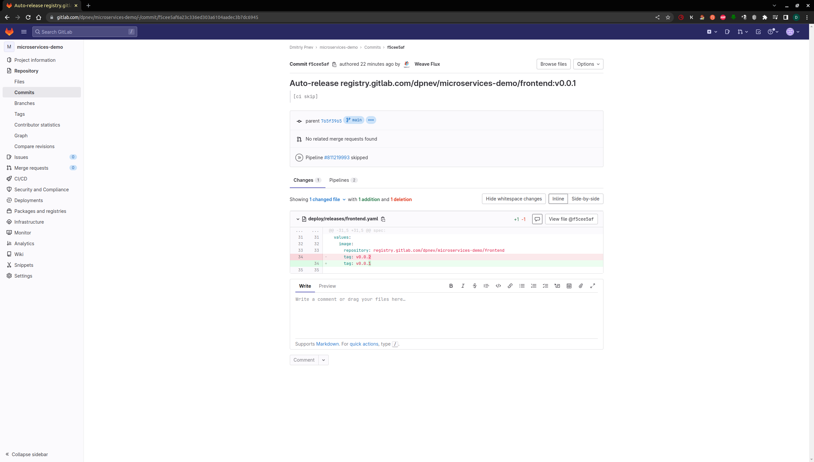
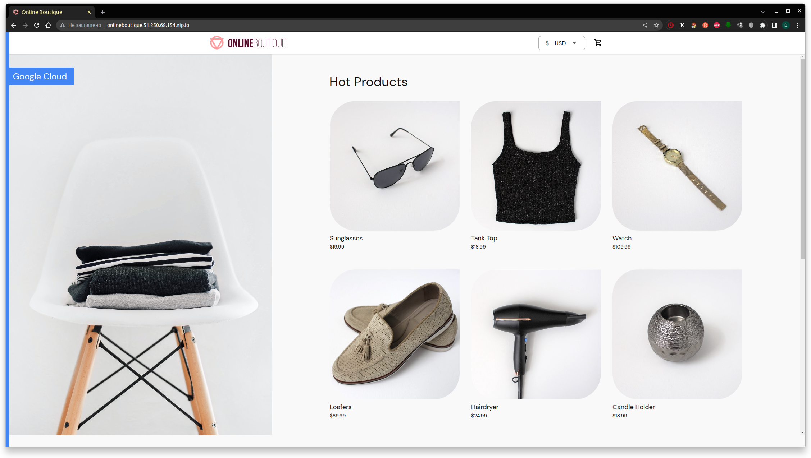

# **Лекция №14: GitOps и инструменты поставки // ДЗ**
> _GitOps и инструменты поставки_

  
kubernetes-gitops

## **Задание:**
Цель:
В данном дз студенты познакомятся с такими инструментами как ArgoCD, Flux, Flagger. Научатся при помощи этих инструментов деплоить приложение в кластер.

Описание/Пошаговая инструкция выполнения домашнего задания:
Все действия описаны в методическом указании.

Критерии оценки:
0 б. - задание не выполнено
1 б. - задание выполнено
2 б. - выполнены все дополнительные задания

---

## **Выполнено:**

### 1. Подготовка GitLab репозитария

~~~bash
git clone https://github.com/GoogleCloudPlatform/microservices-demo
cd microservices-demo
git remote add gitlab git@gitlab.com:dpnev/microservices-demo.git
git remote remove origin
git push -uf gitlab main
~~~

### 2. Создание Helm чартов
Скопируем готовые чарты из [демонстрационного репозитория](https://gitlab.com/express42/kubernetes-platform-demo/microservices-demo/) (директория `deploy/charts` )
~~~bash
tree -L 1 deploy/charts
~~~
~~~
deploy/charts
├── adservice
├── cartservice
├── checkoutservice
├── currencyservice
├── emailservice
├── frontend
├── grafana-load-dashboards
├── loadgenerator
├── paymentservice
├── productcatalogservice
├── recommendationservice
└── shippingservice
~~~

### 3. Подготовка Kubernetes кластера

Поднимаем кластер k8s в yandex-cloud со следующими параметрами:
  - Как минимум 4 ноды типа `standard-v1` (Terraform способ) 
~~~bash
cd terraform-k8s
terraform init
terraform plan
terraform apply
~~~
  - Как минимум 4 ноды типа `standard-v1` (yc cli)
~~~bash
yc managed-kubernetes cluster create k8s-4otus \
--network-id "enp4jp0tqr08ga9s2db6" \
--zone "ru-central1-c" \
--subnet-id "b0cano23aicjlcfpskk3" \
--public-ip \
--release-channel RAPID \
--version 1.24 \
--node-service-account-name tfuser \
--service-account-id "aje43vf2rvfqf5tahtuf" \
--cloud-id "b1g85rkpqt0ukuce35r3" \
--folder-id "b1go8bvc3bokuukkbj26" \
--token "TOKEN" \
--no-user-output
~~~

~~~bash
yc managed-kubernetes node-group create k8s-4otus-node-pool \
--cluster-name k8s-4otus \
--fixed-size 2 \
--platform standard-v1 \
--memory 4 \
--cores 2 \
--disk-size 30 \
--disk-type network-hdd \
--version 1.24 \
--cloud-id "b1g85rkpqt0ukuce35r3" \
--folder-id "b1go8bvc3bokuukkbj26" \
--token "TOKEN"
~~~

~~~bash
yc managed-kubernetes cluster get-credentials k8s-4otus --external --force --folder-id b1go8bvc3bokuukkbj26
~~~

 - Проверяем
~~~bash
kubectl get nodes
~~~
~~~
NAME                        STATUS   ROLES    AGE    VERSION
cl1cm56gb3duo2nvbfcb-asun   Ready    <none>   159m   v1.23.6
cl1cm56gb3duo2nvbfcb-ovaq   Ready    <none>   159m   v1.23.6
cl1cm56gb3duo2nvbfcb-ycod   Ready    <none>   159m   v1.23.6
cl1cm56gb3duo2nvbfcb-yjem   Ready    <none>   159m   v1.23.6
~~~

 - Т.к. в `YandexCloud` не реализована установка `Istio` как аддона, ставим `Istio` через Helm:
~~~bash
helm repo add istio https://istio-release.storage.googleapis.com/charts
helm repo update istio
kubectl create namespace istio-system
helm install istio-base istio/base -n istio-system --version 1.17.1
helm install istiod istio/istiod -n istio-system --wait --version 1.17.1
kubectl create namespace istio-ingress
kubectl label namespace istio-ingress istio-injection=enabled
helm install istio-ingress istio/gateway -n istio-ingress --wait --version 1.17.1
~~~

Проверяем
~~~bash
helm ls -n istio-system
~~~
~~~
NAME            NAMESPACE       REVISION        UPDATED                                 STATUS          CHART           APP VERSION
istio-base      istio-system    1               2023-03-08 22:59:12.30553833 +0300 MSK  deployed        base-1.17.1     1.17.1     
istiod          istio-system    1               2023-03-08 22:59:15.366238727 +0300 MSK deployed        istiod-1.17.1   1.17.1 
~~~

~~~bash
helm status istiod -n istio-system
~~~
~~~
NAME: istiod
LAST DEPLOYED: Wed Mar  8 22:59:15 2023
NAMESPACE: istio-system
STATUS: deployed
REVISION: 1
TEST SUITE: None
NOTES:
"istiod" successfully installed!

To learn more about the release, try:
  $ helm status istiod
  $ helm get all istiod

Next steps:
  * Deploy a Gateway: https://istio.io/latest/docs/setup/additional-setup/gateway/
  * Try out our tasks to get started on common configurations:
    * https://istio.io/latest/docs/tasks/traffic-management
    * https://istio.io/latest/docs/tasks/security/
    * https://istio.io/latest/docs/tasks/policy-enforcement/
    * https://istio.io/latest/docs/tasks/policy-enforcement/
  * Review the list of actively supported releases, CVE publications and our hardening guide:
    * https://istio.io/latest/docs/releases/supported-releases/
    * https://istio.io/latest/news/security/
    * https://istio.io/latest/docs/ops/best-practices/security/

For further documentation see https://istio.io website

Tell us how your install/upgrade experience went at https://forms.gle/hMHGiwZHPU7UQRWe9
~~~

~~~bash
kubectl get deployments -n istio-system --output wide
~~~

~~~
NAME     READY   UP-TO-DATE   AVAILABLE   AGE   CONTAINERS   IMAGES                         SELECTOR
istiod   1/1     1            1           20s   discovery    docker.io/istio/pilot:1.17.1   istio=pilot
~~~

Install an Istio ingress gateway
~~~bash
kubectl create namespace istio-ingress
kubectl label namespace istio-ingress istio-injection=enabled
helm install istio-ingress istio/gateway -n istio-ingress --wait --version 1.17.1
~~~

### Подготовка Kubernetes кластера | Задание со ⭐
- Автоматизируйте создание Kubernetes кластера
- Кластер должен разворачиваться после запуска pipeline в GitLab

Подготовлен следующие манифесты для автоматического разворачивания кластера с `Istio` после запуска pipeline в GitLab 

  
.gitlab-ci.yaml, .variables.yaml 

~~~yaml
include: '.variables.yaml'

stages:
- k8s-ycloud
- dismiss

.base_yc:
before_script:
# Install YC CLI.
    - curl https://storage.yandexcloud.net/yandexcloud-yc/install.sh | bash -s -- -a && cp /root/yandex-cloud/bin/yc /usr/bin/
    - |
      cat <<EOF >> /root/.config/yandex-cloud/config.yaml
      current: default
      profiles:
        default:
          token: ${CI_YC_TOKEN}
          cloud-id: ${CI_CLOUD_ID}
          folder-id: ${CI_CLOUD_ID}
          compute-default-zone: ru-central1-c
      EOF
    - cat /root/.config/yandex-cloud/config.yaml

.managed_kubernetes_create: &managed_kubernetes_create
# Create yc managed kubernetes cluster
- >-
  yc managed-kubernetes cluster create ${CI_CLUSTER_NAME} --network-id ${CI_NETWORK_ID}
  --zone ${CI_ZONE} --subnet-id ${CI_SUBNET_ID} --public-ip --release-channel RAPID
  --version ${CI_K8S_VERSION} --node-service-account-name ${CI_NODE_SERVICE_ACCOUNT_NAME}
  --service-account-id ${CI_SERVICE_ACCOUNT_ID} --cloud-id ${CI_CLOUD_ID}
  --folder-id ${CI_FOLDER_ID} --token ${CI_YC_TOKEN} --no-user-output --enable-network-policy

.managed_node_group_create: &managed_node_group_create
- >-
  yc managed-kubernetes node-group create ${CI_NODE_POOL} --cluster-name ${CI_CLUSTER_NAME}
  --auto-scale min=${CI_AUTO_SCALE_INITIAL},max=${CI_AUTO_SCALE_MAX},initial=${CI_AUTO_SCALE_INITIAL}
  --platform ${CI_NODE_PLATFORM} --memory ${CI_NODE_MEMORY} --cores ${CI_NODE_CORES}
  --disk-type ${CI_NODE_DISK_TYPE} --disk-size ${CI_NODE_DISK_SIZE} --version ${CI_K8S_VERSION}
  --cloud-id ${CI_CLOUD_ID} --folder-id ${CI_FOLDER_ID} --token ${CI_YC_TOKEN}
  --network-interface subnets=${CI_SUBNET_ID},ipv4-address=nat

.kubectl_install: &kubectl_install
- wget -O /usr/local/bin/kubectl "https://storage.googleapis.com/kubernetes-release/release/${CI_KUBECTL_VER}/bin/linux/amd64/kubectl"
- chmod +x /usr/local/bin/kubectl
- |
      yc managed-kubernetes cluster get-credentials ${CI_CLUSTER_NAME} --context-name default \
  --external --force --cloud-id ${CI_CLOUD_ID} --folder-id ${CI_FOLDER_ID} --token ${CI_YC_TOKEN}
- ls -la /root/.kube/
- cat /root/.kube/config
- kubectl cluster-info --kubeconfig /root/.kube/config

.helm_install: &helm_install
- |
      export HELM_URL="https://get.helm.sh"
  export HELM_TAR_FILE="helm-${CI_HELM_VER}-linux-amd64.tar.gz"
  echo "install HELM ${CI_HELM_VER} from \"${HELM_URL}/${HELM_TAR_FILE}\""
  mkdir -p /tmp/helm
  wget -O "/tmp/${HELM_TAR_FILE}" "${HELM_URL}/${HELM_TAR_FILE}"
  tar -xzvf "/tmp/${HELM_TAR_FILE}" -C /tmp/helm
  mv /tmp/helm/linux-amd64/helm /usr/bin/helm
  rm -rf /tmp/helm
  chmod +x /usr/bin/helm
  helm version

.istio_install: &istio_install
- helm repo add istio https://istio-release.storage.googleapis.com/charts
- helm repo update istio
- kubectl create namespace istio-system || true
- helm upgrade --install istio-base istio/base -n istio-system --version ${CI_ISTIO_VERSION}
- helm ls -n istio-system
- helm upgrade --install istiod istio/istiod -n istio-system --version ${CI_ISTIO_VERSION} --wait
- helm ls -n istio-system
- helm status istiod -n istio-system
- kubectl create namespace istio-ingress || true
- kubectl label namespace istio-ingress istio-injection=enabled
- helm upgrade --install istio-ingress istio/gateway -n istio-ingress --version ${CI_ISTIO_VERSION} --wait

.dismiss:
extends: .base_yc
script:
- yc managed-kubernetes cluster delete ${CI_CLUSTER_NAME} --cloud-id ${CI_CLOUD_ID} --folder-id ${CI_FOLDER_ID} --token ${CI_YC_TOKEN}

k8s-ycloud:
extends: .base_yc
stage: k8s-ycloud
allow_failure: true
script:
- *managed_kubernetes_create
- *managed_node_group_create
- *kubectl_install
- *helm_install
- *istio_install

dismiss:
extends: .dismiss
stage: dismiss
when: manual
~~~
- `.variables.yml`
~~~yaml
variables:
  CI_CLUSTER_NAME: k8s-4otus
  CI_NETWORK_ID: enp4jp0tqr08ga9s2db6
  CI_ZONE: ru-central1-c
  CI_SUBNET_ID: b0cano23aicjlcfpskk3
  CI_K8S_VERSION: "1.24"
  CI_NODE_SERVICE_ACCOUNT_NAME: tfuser
  CI_SERVICE_ACCOUNT_ID: aje43vf2rvfqf5tahtuf
  CI_CLOUD_ID: b1g85rkpqt0ukuce35r3
  CI_FOLDER_ID: b1go8bvc3bokuukkbj26
  CI_NODE_POOL: k8s-4otus-node-pool
  CI_AUTO_SCALE_MIN: 1
  CI_AUTO_SCALE_MAX: 4
  CI_AUTO_SCALE_INITIAL: 1
  CI_NODE_PLATFORM: standard-v1
  CI_NODE_MEMORY: 4
  CI_NODE_CORES: 2
  CI_NODE_DISK_TYPE: network-hdd
  CI_NODE_DISK_SIZE: 30
  CI_KUBECTL_VER: v1.25.3
  CI_HELM_VER: v3.11.2
  CI_ISTIO_VERSION: 1.17.1
~~~

### 4. Continuous Integration | Задание со ⭐
Подготовим pipeline, который будет содержать следующие стадии: 
- Сборку Docker образа для каждого из микросервисов
- Push данного образа в Docker Hub
В качестве тега образа используем `tag` коммита, инициирующего сборку (переменная `CI_COMMIT_TAG` в GitLab CI)

- Создаем файл `.build.yaml` следующего содержания
~~~yaml
build:adservice:
  extends: build
  variables: 
    SERVICE: adservice
    SRVPATH: adservice

build:checkoutservice:
  extends: build
  variables: 
    SERVICE: checkoutservice
    SRVPATH: checkoutservice
...
~~~

- И добавляем в манифест pipeline описание джобы билда 
~~~yaml
build:
  extends: .docker
  stage: build
  allow_failure: true
  before_script:
    - docker login --username oauth --password ${CI_YC_TOKEN} cr.yandex
  script:
    - cd src/${SRVPATH}
    - docker build . -f Dockerfile -t cr.yandex/${CI_CR_YANDEX_ID}/${SERVICE}:${CI_COMMIT_SHORT_SHA}
    - docker push cr.yandex/${CI_CR_YANDEX_ID}/${SERVICE}:${CI_COMMIT_SHORT_SHA}
~~~

Образы у нас успешно собираются и также удачно у нас заканчивается бесплатный лимит времени на раннерах Гитлаба.
Если что, придется отложить запуск CI/CD до следующего месяца :)  

### 5. GitOps

Подготовка
> https://github.com/fluxcd/helm-operator/tree/master/chart/helm-operator

- Добавим официальный репозиторий Flux
~~~bash
helm repo add fluxcd https://charts.fluxcd.io
helm repo update fluxcd
~~~

- Установим CRD, добавляющую в кластер новый ресурс - HelmRelease:
~~~bash
kubectl apply -f https://raw.githubusercontent.com/fluxcd/helm-operator/1.4.4/deploy/crds.yaml
~~~

- Произведем установку Flux в кластер, в namespace flux
~~~bash
kubectl create namespace flux
helm upgrade --install flux fluxcd/flux -f flux.values.yaml --namespace flux
~~~
~~~
NOTES:
Get the Git deploy key by either (a) running

  kubectl -n flux logs deployment/flux | grep identity.pub | cut -d '"' -f2

or by (b) installing fluxctl through
https://fluxcd.io/legacy/flux/references/fluxctl/#installing-fluxctl
and running:

  fluxctl identity --k8s-fwd-ns flux

---
**Flux v1 is deprecated, please upgrade to v2 as soon as possible!**
~~~

- Наконец, добавим в свой профиль GitLab публичный ssh-ключ, при помощи которого flux получит доступ к нашему git-репозиторию.
~~~bash
kubectl -n flux logs deployment/flux | grep identity.pub | cut -d '"' -f2
~~~

- Установим Helm operator:
~~~bash
helm upgrade --install helm-operator fluxcd/helm-operator -f helm-operator.values.yaml --namespace flux
~~~
~~~
Release "helm-operator" does not exist. Installing it now.
NAME: helm-operator
LAST DEPLOYED: Sun Mar 19 18:04:06 2023
NAMESPACE: flux
STATUS: deployed
REVISION: 1
TEST SUITE: None
NOTES:
Flux Helm Operator docs https://fluxcd.io/legacy/helm-operator

Example:

AUTH_VALUES=$(cat <<-END
usePassword: true
password: "redis_pass"
usePasswordFile: true
END
)

kubectl create secret generic redis-auth --from-literal=values.yaml="$AUTH_VALUES"

`cat <<EOF | kubectl apply -f -
apiVersion: helm.fluxcd.io/v1
kind: HelmRelease
metadata:
  name: redis
  namespace: default
spec:
  releaseName: redis
  chart:
    repository: https://kubernetes-charts.storage.googleapis.com
    name: redis
    version: 10.5.7
  valuesFrom:
  - secretKeyRef:
      name: redis-auth
  values:
    master:
      persistence:
        enabled: false
    volumePermissions:
      enabled: true
    metrics:
      enabled: true
    cluster:
      enabled: false
EOF`

watch kubectl get hr
~~~

- Установим fluxctl на локальную машину для управления нашим CD инструментом.
~~~bash
curl -s https://fluxcd.io/install.sh | sudo bash
~~~

Пришло время проверить корректность работы Flux. Как мы уже знаем, Flux умеет автоматически синхронизировать состояние кластера и
репозитория. Это касается не только сущностей HelmRelease , которыми мы будем оперировать для развертывания приложения, но и обыкновенных манифестов.
Поместим манифест, описывающий namespace `microservices-demo` в директорию `deploy/namespaces` и сделаем push в GitLab:
~~~bash
kubectl get ns | grep microservices-demo  
~~~
~~~
microservices-demo   Active   24s
~~~
~~~bash
kubectl logs flux-7875d5c549-fjpxj -n flux | grep microservices-demo 
~~~
~~~
...
ts=2023-03-18T21:00:36.291919662Z caller=sync.go:608 method=Sync cmd="kubectl apply -f -" took=1.352943488s err=null output="namespace/microservices-demo created"
...
~~~

Мы подобрались к сущностям, которыми управляет helm-operator - `HelmRelease`.
Для описания сущностей такого вида создадим отдельную директорию deploy/releases и поместим туда файл `frontend.yaml` с описанием конфигурации релиза.
~~~yaml
apiVersion: helm.fluxcd.io/v1
kind: HelmRelease
metadata:
  name: frontend
  namespace: microservices-demo
  annotations:
    fluxcd.io/ignore: "false"
    # fluxcd.io/automated: "true" Аннотация разрешает автоматическое обновление релиза в  Kubernetes кластере
    # в случае изменения версии Docker образа в Registry
    fluxcd.io/automated: "true"
    # Указываем Flux следить за обновлениями конкретных Docker образов
    # в Registry.
    # Новыми считаются только образы, имеющие версию выше текущей и
    # отвечающие маске семантического версионирования ~0.0 (например,
    # 0.0.1, 0.0.72, но не 1.0.0)
    flux.weave.works/tag.chart-image: semver:~v0.0
spec:
  releaseName: frontend
  helmVersion: v3
  # Helm chart, используемый для развертывания релиза. В нашем случае
  #указываем git-репозиторий, и директорию с чартом внутри него
  chart:
    git: git@gitlab.com:dpnev/microservices-demo.git
    ref: main
    path: deploy/charts/frontend
  # Переопределяем переменные Helm chart. В дальнейшем Flux может сам
  # переписывать эти значения и делать commit в git-репозиторий (например,
  # изменять тег Docker образа при его обновлении в Registry)
  values:
    image:
      repository: cr.yandex/crpn6n5ssda7s8tdsdf5/frontend
      tag: v0.0.1
~~~

### HelmRelease | Проверка

- Ловим ошибку в логах `helm-operator` про `kind: ServiceMonitor` при деплое из чарта `deploy/charts/frontend` и поэтому ставим дополнительно `prometheus-operator` через  `kubectl apply` из [офф. репозитория](https://github.com/prometheus-operator/kube-prometheus) (Bring`em on!)
~~~bash
cd ./kube-prometheus
# Create the namespace and CRDs, and then wait for them to be available before creating the remaining resources
# Note that due to some CRD size we are using kubectl server-side apply feature which is generally available since kubernetes 1.22.
# If you are using previous kubernetes versions this feature may not be available and you would need to use kubectl create instead.
kubectl apply --server-side -f manifests/setup
kubectl wait \
--for condition=Established \
--all CustomResourceDefinition \
--namespace=monitoring
kubectl apply -f manifests/
~~~

- Инициируем синхронизацию вручную
~~~bash
fluxctl --k8s-fwd-ns flux sync
~~~

Убедимся что HelmRelease для микросервиса frontend появился в кластере:
~~~bash
kubectl get helmrelease -n microservices-demo
~~~
~~~
NAME       RELEASE    PHASE       RELEASESTATUS   MESSAGE                                                                       AGE
frontend   frontend   Succeeded   deployed        Release was successful for Helm release 'frontend' in 'microservices-demo'.   61m
~~~

~~~bash
helm list -n microservices-demo
~~~
~~~
helm list -n microservices-demo
NAME            NAMESPACE               REVISION        UPDATED                                 STATUS          CHART           APP VERSION
frontend        microservices-demo      1               2023-03-19 15:58:09.62715469 +0000 UTC  deployed        frontend-0.21.0 1.16.0   
~~~

### Обновление образа

Т.к. у нас закончилось время на раннерах GitLab вместо сборки нам остается только тегирование образа до версии v0.0.2
~~~bash
docker tag cr.yandex/crpn6n5ssda7s8tdsdf5/frontend:41ff6a8d registry.gitlab.com/dpnev/microservices-demo/frontend:v0.0.5
docker push registry.gitlab.com/dpnev/microservices-demo/frontend:v0.0.5
~~~

Дождемся автоматического обновления релиза в Kubernetes кластере
~~~bash
watch helm history frontend -n microservices-demo                                                                    
~~~
~~~
REVISION        UPDATED                         STATUS          CHART           APP VERSION     DESCRIPTION     
1               Sun Mar 19 15:58:09 2023        superseded      frontend-0.21.0 1.16.0          Install complete
2               Sun Mar 19 17:37:43 2023        deployed        frontend-0.21.0 1.16.0          Upgrade complete
~~~

Проверим, изменилось ли что-либо в git-репозитории (в частности, в файле deploy/releases/frontend.yaml )

### Обновление Helm chart

1. Попробуем внести изменения в Helm chart frontend и поменять имя `deployment` на `frontend-hipster`
2. Сделаем push измененного Helm chart в GitLab и понаблюдаем за процессом
~~~
│ ts=2023-03-19T18:14:38.005391399Z caller=release.go:353 component=release release=frontend targetNamespace=microservices-demo resource=microservices-demo:helmrelease/frontend helmVersion=v3 info="running upgrade" action=upgrade                                            │
│ ts=2023-03-19T18:14:38.043672831Z caller=helm.go:69 component=helm version=v3 info="preparing upgrade for frontend" targetNamespace=microservices-demo release=frontend                                                                                                        │
│ ts=2023-03-19T18:14:38.049694917Z caller=helm.go:69 component=helm version=v3 info="resetting values to the chart's original version" targetNamespace=microservices-demo release=frontend                                                                                      │
│ ts=2023-03-19T18:14:39.08960667Z caller=helm.go:69 component=helm version=v3 info="performing update for frontend" targetNamespace=microservices-demo release=frontend                                                                                                         │
│ ts=2023-03-19T18:14:39.116000675Z caller=helm.go:69 component=helm version=v3 info="creating upgraded release for frontend" targetNamespace=microservices-demo release=frontend                                                                                                │
│ ts=2023-03-19T18:14:39.131266821Z caller=helm.go:69 component=helm version=v3 info="checking 5 resources for changes" targetNamespace=microservices-demo release=frontend                                                                                                      │
│ ts=2023-03-19T18:14:39.139887602Z caller=helm.go:69 component=helm version=v3 info="Looks like there are no changes for Service \"frontend\"" targetNamespace=microservices-demo release=frontend                                                                              │
│ ts=2023-03-19T18:14:39.170376272Z caller=helm.go:69 component=helm version=v3 info="Created a new Deployment called \"frontend-hipster\" in microservices-demo\n" targetNamespace=microservices-demo release=frontend                                                          │
│ ts=2023-03-19T18:14:39.341628164Z caller=helm.go:69 component=helm version=v3 info="Deleting \"frontend\" in microservices-demo..." targetNamespace=microservices-demo release=frontend                                                                                        │
│ ts=2023-03-19T18:14:39.360912302Z caller=helm.go:69 component=helm version=v3 info="updating status for upgraded release for frontend" targetNamespace=microservices-demo release=frontend                                                                                     │
│ ts=2023-03-19T18:14:39.459025259Z caller=release.go:364 component=release release=frontend targetNamespace=microservices-demo resource=microservices-demo:helmrelease/frontend helmVersion=v3 info="upgrade succeeded" revision=6b577e2a2cc3e7b05b5bc0e16e4eb4d1249ddddd phase │
│ ts=2023-03-19T18:15:08.291572703Z caller=release.go:79 component=release release=frontend targetNamespace=microservices-demo resource=microservices-demo:helmrelease/frontend helmVersion=v3 info="starting sync run"                                                          │
│ ts=2023-03-19T18:15:08.683990547Z caller=release.go:289 component=release release=frontend targetNamespace=microservices-demo resource=microservices-demo:helmrelease/frontend helmVersion=v3 info="running dry-run upgrade to compare with release version '5'" action=dry-ru │
│ ts=2023-03-19T18:15:08.69136116Z caller=helm.go:69 component=helm version=v3 info="preparing upgrade for frontend" targetNamespace=microservices-demo release=frontend                                                                                                         │
│ ts=2023-03-19T18:15:08.699723971Z caller=helm.go:69 component=helm version=v3 info="resetting values to the chart's original version" targetNamespace=microservices-demo release=frontend                                                                                      │
~~~

### Самостоятельное задание

Добавим манифесты HelmRelease для всех микросервисов входящих в состав HipsterShop

    
Из-за недоступности сборки приходится заморрочиться с tags & registry images

~~~bash
#docker tag cr.yandex/crpn6n5ssda7s8tdsdf5/frontend:41ff6a8d registry.gitlab.com/dpnev/microservices-demo/frontend:v0.0.5
#docker push registry.gitlab.com/dpnev/microservices-demo/frontend:v0.0.5
docker pull cr.yandex/crpn6n5ssda7s8tdsdf5/adservice:41ff6a8d
docker tag cr.yandex/crpn6n5ssda7s8tdsdf5/adservice:41ff6a8d registry.gitlab.com/dpnev/microservices-demo/adservice:v0.0.1
docker push registry.gitlab.com/dpnev/microservices-demo/adservice:v0.0.1

docker pull cr.yandex/crpn6n5ssda7s8tdsdf5/cartservice:41ff6a8d
docker tag cr.yandex/crpn6n5ssda7s8tdsdf5/cartservice:41ff6a8d registry.gitlab.com/dpnev/microservices-demo/cartservice:v0.0.1
docker push registry.gitlab.com/dpnev/microservices-demo/cartservice:v0.0.1

docker pull cr.yandex/crpn6n5ssda7s8tdsdf5/checkoutservice:41ff6a8d
docker tag cr.yandex/crpn6n5ssda7s8tdsdf5/checkoutservice:41ff6a8d registry.gitlab.com/dpnev/microservices-demo/checkoutservice:v0.0.1
docker push registry.gitlab.com/dpnev/microservices-demo/checkoutservice:v0.0.1

docker pull cr.yandex/crpn6n5ssda7s8tdsdf5/currencyservice:41ff6a8d
docker tag cr.yandex/crpn6n5ssda7s8tdsdf5/currencyservice:41ff6a8d registry.gitlab.com/dpnev/microservices-demo/currencyservice:v0.0.1
docker push registry.gitlab.com/dpnev/microservices-demo/currencyservice:v0.0.1

docker pull cr.yandex/crpn6n5ssda7s8tdsdf5/emailservice:41ff6a8d
docker tag cr.yandex/crpn6n5ssda7s8tdsdf5/emailservice:41ff6a8d registry.gitlab.com/dpnev/microservices-demo/emailservice:v0.0.1
docker push registry.gitlab.com/dpnev/microservices-demo/emailservice:v0.0.1

docker pull cr.yandex/crpn6n5ssda7s8tdsdf5/loadgenerator:41ff6a8d
docker tag cr.yandex/crpn6n5ssda7s8tdsdf5/loadgenerator:41ff6a8d registry.gitlab.com/dpnev/microservices-demo/loadgenerator:v0.0.1
docker push registry.gitlab.com/dpnev/microservices-demo/loadgenerator:v0.0.1

docker pull cr.yandex/crpn6n5ssda7s8tdsdf5/paymentservice:41ff6a8d
docker tag cr.yandex/crpn6n5ssda7s8tdsdf5/paymentservice:41ff6a8d registry.gitlab.com/dpnev/microservices-demo/paymentservice:v0.0.1
docker push registry.gitlab.com/dpnev/microservices-demo/paymentservice:v0.0.1

docker pull cr.yandex/crpn6n5ssda7s8tdsdf5/productcatalogservice:41ff6a8d
docker tag cr.yandex/crpn6n5ssda7s8tdsdf5/productcatalogservice:41ff6a8d registry.gitlab.com/dpnev/microservices-demo/productcatalogservice:v0.0.1
docker push registry.gitlab.com/dpnev/microservices-demo/productcatalogservice:v0.0.1

docker pull cr.yandex/crpn6n5ssda7s8tdsdf5/recommendationservice:41ff6a8d
docker tag cr.yandex/crpn6n5ssda7s8tdsdf5/recommendationservice:41ff6a8d registry.gitlab.com/dpnev/microservices-demo/recommendationservice:v0.0.1
docker push registry.gitlab.com/dpnev/microservices-demo/recommendationservice:v0.0.1

docker pull cr.yandex/crpn6n5ssda7s8tdsdf5/shippingservice:41ff6a8d
docker tag cr.yandex/crpn6n5ssda7s8tdsdf5/shippingservice:41ff6a8d registry.gitlab.com/dpnev/microservices-demo/shippingservice:v0.0.1
docker push registry.gitlab.com/dpnev/microservices-demo/shippingservice:v0.0.1
~~~

Проверим, что все микросервисы успешно развернулись в Kubernetes кластере:
~~~bash
kubectl delete ns microservices-demo
kubectl get pods -n microservices-demo -w
~~~
~~~
NAME                                    READY   STATUS     RESTARTS   AGE
adservice-65778c4cf6-t8jxl              1/1     Running    0          9m51s
checkoutservice-7d765687d8-fd967        1/1     Running    0          9m52s
currencyservice-86d9454dbd-x4vvn        1/1     Running    0          9m44s
emailservice-8587ccd6bd-p54qh           1/1     Running    0          9m51s
frontend-844976646c-h8gzn               1/1     Running    0          9m44s
loadgenerator-57d4cb45b4-dzmj7          0/1     Init:0/1   0          9m43s
paymentservice-7ffc98fdd8-9blnn         1/1     Running    0          9m35s
productcatalogservice-66944f6b6-xs2q8   1/1     Running    0          9m41s
recommendationservice-5d87f6fd-nzdsw    1/1     Running    0          9m34s
shippingservice-597478d856-vw527        1/1     Running    0          9m34s
~~~

Для `loadgenerator` не получается пройти успешное выполнение init контейнера, т.к. `frontend` отдает `500`.
Смотрим логи `frontend` 
~~~
"error":"could not retrieve cart: rpc error: code = Unavailable desc = connection error: desc = \"transport: Error while dialing: dial tcp: lookup cartservice on 10.96.128.2:53: no such host
~~~

`cartservice` не задеплоился по каким-то причинам, смотрим лог helm-operator:
~~~bash
kubectl logs helm-operator-55769d46b8-wrjln -n flux | grep cartservice | tail -1
~~~
~~~
ts=2023-03-20T20:04:50.936076846Z caller=release.go:85 component=release release=cartservice targetNamespace=microservices-demo resource=microservices-demo:helmrelease/cartservice helmVersion=v3 error="failed to prepare chart for release: no cached repository for helm-manager-1067d9c6027b8c3f27b49e40521d64be96ea412858d8e45064fa44afd3966ddc found. (try 'helm repo update'): open /root/.cache/helm/repository/helm-manager-1067d9c6027b8c3f27b49e40521d64be96ea412858d8e45064fa44afd3966ddc-index.yaml: no such file or directory"
~~~

Оказывается чарт `redis` сменил свое расположение с "https://kubernetes-charts.storage.googleapis.com/" на "https://charts.helm.sh/stable/" 
Правим соответственно `deploy/charts/cartservice/Chart.yaml`
Проверяем
~~~bash
kubectl get pods -n microservices-demo
~~~
Все сервисы поднялись!!!

## Canary deployments с Flagger и Istio

### Flagger. 
Flagger - оператор Kubernetes, созданный для автоматизации canary deployments.
Flagger может использовать: Istio, Linkerd, App Mesh или nginx для маршрутизации трафика Prometheus для анализа 
канареечного релиза

###  Установка Flagger
~~~bash
helm repo add flagger https://flagger.app
helm repo update flagger
~~~

- Установка CRD для Flagger
~~~bash
kubectl apply -f https://raw.githubusercontent.com/weaveworks/flagger/master/artifacts/flagger/crd.yaml
~~~

- Установка flagger с указанием использовать Istio:
Установим сначала prometheus
~~~bash
helm install prometheus -n istio-system prometheus-community/prometheus
~~~

~~~bash
helm upgrade --install flagger flagger/flagger \
--namespace=istio-system \
--set crd.create=false \
--set meshProvider=istio \
--set metricsServer=http://prometheus-server:80
~~~

### Istio | Sidecar Injection

Изменим созданное ранее описание namespace microservices-demo
Последняя строка указывает на необходимость добавить в каждый pod sidecar контейнер с envoy proxy.
~~~yaml
apiVersion: v1
kind: Namespace
metadata:
  name: microservices-demo
  labels:
    istio-injection: enabled
~~~
~~~
microservices-demo   Active   5h57m   fluxcd.io/sync-gc-mark=sha256.g7l4ABXyUdLLCK94FOGVhAixrw5ameYDiAjb02w1Q2k,istio-injection=enabled,kubernetes.io/metadata.name=microservices-demo
~~~

После синхронизации проверку можно выполнить командой
~~~bash
kubectl get ns microservices-demo --show-labels
~~~

Самый простой способ добавить sidecar контейнер в уже запущенные pod - удалить их:
~~~bash
kubectl delete pods --all -n microservices-demo
~~~

Или сразу весь namespace, у нас же GitOps :)
~~~bash
kubectl delete ns microservices-demo
~~~

После этого можно проверить, что контейнер с названием `istioproxy` появился внутри каждого pod:
~~~bash
kubectl describe pod -l app=frontend -n microservices-demo
~~~
~~~
...
  istio-proxy:
    Container ID:  containerd://537ee0e2423b31feee1994903c2a6b93a1cafa790a2ed816717c79ee6cbfb6db
    Image:         docker.io/istio/proxyv2:1.17.1
    Image ID:      docker.io/istio/proxyv2@sha256:2152aea5fbe2de20f08f3e0412ad7a4cd54a492240ff40974261ee4bdb43871d
    Port:          15090/TCP
    Host Port:     0/TCP
    Args:
      proxy
      sidecar
      --domain
      $(POD_NAMESPACE).svc.cluster.local
      --proxyLogLevel=warning
      --proxyComponentLogLevel=misc:error
      --log_output_level=default:info
      --concurrency
      2
    State:          Running
...
~~~

### Доступ к frontend. Istio | VirtualService. Istio | Gateway

> https://istio.io/docs/concepts/traffic-management/#virtual-services
> https://istio.io/docs/concepts/traffic-management/#gateways
 
На текущий момент у нас отсутствует ingress и мы не можем получить доступ к `frontend` снаружи кластера.
В то же время `Istio` в качестве альтернативы классическому `ingress` предлагает свой набор абстракций.
Чтобы настроить маршрутизацию трафика к приложению с использованием `Istio`, нам необходимо добавить ресурсы
`VirtualService` и `Gateway`
Создадим директорию `deploy/istio` и поместим в нее следующие манифесты:
- [frontend-vs.yaml](./deploy/istio/frontend-vs.yaml)
- [frontend-gw.yaml](./deploy/istio/frontend-gw.yaml)

Созданный Gateway можно увидеть следующим образом:
~~~bash
kubectl get gateway -n microservices-demo
~~~
~~~
NAME               AGE
frontend-gateway   17m
~~~

Для доступа снаружи нам понадобится EXTERNAL-IP (INGRESS_HOST) сервиса `istio-ingress`:
~~~bash
export INGRESS_NAME=istio-ingress
export INGRESS_NS=istio-ingress 
kubectl get svc "$INGRESS_NAME" -n "$INGRESS_NS"
export INGRESS_HOST=$(kubectl -n "$INGRESS_NS" get service "$INGRESS_NAME" -o jsonpath='{.status.loadBalancer.ingress[0].ip}')
export INGRESS_PORT=$(kubectl -n "$INGRESS_NS" get service "$INGRESS_NAME" -o jsonpath='{.spec.ports[?(@.name=="http2")].port}')
export SECURE_INGRESS_PORT=$(kubectl -n "$INGRESS_NS" get service "$INGRESS_NAME" -o jsonpath='{.spec.ports[?(@.name=="https")].port}')
echo "INGRESS_HOST=$INGRESS_HOST, INGRESS_PORT=$INGRESS_PORT"
echo "INGRESS_HOST=$INGRESS_HOST, INGRESS_PORT=$SECURE_INGRESS_PORT"
~~~

### Istio | Самостоятельное задание

В нашей ситуации ресурсы `Gateway` и `VirtualService` логически являются частью инфраструктурного кода, описывающего окружение
микросервиса frontend. Поэтому, оправданно будет перенести манифесты в Helm chart. Дополним Helm chart frontend 
манифестами `gateway.yaml` и `virtualService.yaml` (на самом деле они уже там присутствовали из исходного репозитория `express42`).
Правим только `gateway.yaml` в соответствии с документацией `istio`, т.к. мы устанавливали Istio, `using Helm following the standard documentation`
~~~yaml
...
# The selector matches the ingress gateway pod labels.
# If you installed Istio using Helm following the standard documentation, this would be "istio=ingress"
spec:
selector:
#istio: ingressgateway <- remove
istio: ingress # <- add
...
~~~

Оригинальные манифесты удалим вместе с директорией `deploy/istio`.

### Flagger | Canary
Перейдем непосредственно к настройке канареечных релизов. Добавим в Helm chart `frontend` еще один файл - `canary.yaml`
В нем будем хранить описание стратегии, по которой необходимо обновлять данный микросервис.
> Узнать подробнее о Canary Custom Resource можно по ссылке https://docs.flagger.app/how-it-works#canary-custom-resource

Проверим, что Flagger инициализировал canary ресурс frontend:
~~~bash
kubectl get canary -n microservices-demo
~~~
~~~
NAME       STATUS         WEIGHT   LASTTRANSITIONTIME
frontend   Initializing   0        2023-03-21T07:20:31
~~~

Обновил pod, добавив ему к названию постфикс `primary`:
~~~bash
kubectl get pods -n microservices-demo -l app=frontend-primary
~~~
~~~
NAME                                        READY   STATUS    RESTARTS   AGE
frontend-hipster-primary-79544c5d7b-xvcl5   2/2     Running   0          117s
~~~

Попробуем провести релиз. Соберите новый образ frontend с тегом v0.0.6 и сделайте push в Registry.
Через некоторое время в выводе `kubectl describe canary frontend -n microservices-demo` мы сможем наблюдать следующую
картину:
~~~bash
docker build ./ -t registry.gitlab.com/dpnev/microservices-demo/frontend:v0.0.9
docker push registry.gitlab.com/dpnev/microservices-demo/frontend:v0.0.9
~~~

~~~bash
kubectl describe canary frontend -n microservices-demo
~~~
~~~
  Type     Reason  Age                 From     Message
  ----     ------  ----                ----     -------
  Warning  Synced  20m                 flagger  frontend-primary.microservices-demo not ready: waiting for rollout to finish: observed deployment generation less than desired generation
  Normal   Synced  20m (x2 over 20m)   flagger  all the metrics providers are available!
  Normal   Synced  20m                 flagger  Initialization done! frontend.microservices-demo
  Normal   Synced  17m                 flagger  Starting canary analysis for frontend.microservices-demo
  Warning  Synced  17m                 flagger  canary deployment frontend.microservices-demo not ready: waiting for rollout to finish: 1 old replicas are pending termination
  Normal   Synced  13m (x2 over 18m)   flagger  New revision detected! Scaling up frontend.microservices-demo
  Normal   Synced  12m (x2 over 17m)   flagger  Advance frontend.microservices-demo canary weight 10
  Normal   Synced  12m (x2 over 16m)   flagger  Advance frontend.microservices-demo canary weight 20
  Normal   Synced  11m (x2 over 16m)   flagger  Advance frontend.microservices-demo canary weight 30
  Normal   Synced  11m (x2 over 15m)   flagger  Advance frontend.microservices-demo canary weight 40
  Normal   Synced  10m (x2 over 15m)   flagger  Advance frontend.microservices-demo canary weight 50
  Normal   Synced  10m                 flagger  Copying frontend.microservices-demo template spec to frontend-primary.microservices-demo
  Normal   Synced  9m3s (x6 over 14m)  flagger  (combined from similar events): Promotion completed! Scaling down frontend.microservices-demo
~~~

~~~bash
kubectl get canaries -n microservices-demo 
~~~
~~~
NAME       STATUS      WEIGHT   LASTTRANSITIONTIME
frontend   Succeeded   0        2023-03-21T10:09:02Z
~~~

Ссылка на репозиторий - https://gitlab.com/dpnev/microservices-demo/

# **Полезное:**

- https://cloud.yandex.ru/docs/security/domains/kubernetes
- https://istio.io/latest/docs/setup/install/helm/

~~~bash
yc managed-kubernetes cluster stop k8s-4otus
~~~

~~~bash
yc managed-kubernetes cluster start k8s-4otus
~~~

    
Полезные команды fluxctl

- синхронизация вручную
~~~bash
fluxctl --k8s-fwd-ns flux sync
~~~

- переменная окружения, указывающая на namespace, в который установлен flux (альтернатива ключу --k8s-fwd-ns <flux installation ns> )
~~~bash
export FLUX_FORWARD_NAMESPACE=flux
~~~

- принудительно запустить синхронизацию состояния git репозитория с кластером (при условии установленной переменной `FLUX_FORWARD_NAMESPACE`)
~~~bash
fluxctl sync
~~~

- посмотреть все workloads, которые находятся в зоне видимости flux
~~~bash
fluxctl list-workloads -a
~~~
 
- посмотреть все Docker образы, используемые в кластере (в namespace microservicesdemo)
~~~bash
fluxctl list-images -n microservices-demo
~~~

- выключить/включить автоматизацию управления workload 
~~~bash
fluxctl deautomate
fluxctl automate 
~~~

- установить всем сервисам в workload `microservices-demo:helmrelease/frontend` политику обновления образов из Registry
на базе семантического версионирования c маской `0.1.*`
~~~bash
fluxctl policy -w microservices-demo:helmrelease/frontend --tag-all='semver:~0.1'
~~~

- принудительно инициировать сканирование Registry на предмет наличия свежих Docker  образов
~~~bash
fluxctl release --workload=microservicesdemo:helmrelease/frontend --update-all-images
~~~

