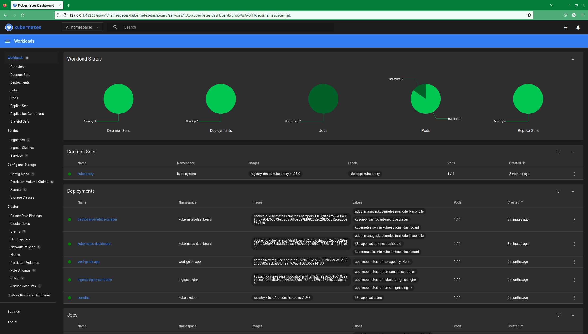

# **Лекция №2: Знакомство с Kubernetes, основные понятия и архитектура // ДЗ**
> _kubernetes-intro_

  
Знакомство с Kubernetes

## **Задание:**
Знакомство с решениями для запуска локального Kubernetes кластера, создание первого pod
Цель:

В данном дз студенты научатся формировать локальное окружение, запустят локальную версию kubernetes при помощи minikube, научатся использовать CLI утилиту kubectl для управления kubernetes.

Описание/Пошаговая инструкция выполнения домашнего задания:

Все действия описаны в методическом указании.

Критерии оценки:

0 б. - задание не выполнено
1 б. - задание выполнено
2 б. - выполнены все дополнительные задания

---

## **Выполнено:**
1. Настройка локального окружения. Запуск первого контейнера. Работа с kubectl

- Установка kubectl (Ubuntu) 
> [https://kubernetes.io/ru/docs/tasks/tools/install-kubectl/](https://kubernetes.io/ru/docs/tasks/tools/install-kubectl/)

~~~bash
sudo apt-get update && sudo apt-get install -y apt-transport-https
curl -s https://packages.cloud.google.com/apt/doc/apt-key.gpg | sudo apt-key add -
echo "deb https://apt.kubernetes.io/ kubernetes-xenial main" | sudo tee -a /etc/apt/sources.list.d/kubernetes.list
sudo apt-get update
sudo apt-get install -y kubectl

kubectl version --client --short
Flag --short has been deprecated, and will be removed in the future. The --short output will become the default.
Client Version: v1.26.0
Kustomize Version: v4.5.7

#Настройка автозаполнения для kubectl
source <(kubectl completion zsh)  # настройка автодополнения в текущую сессию zsh
echo "[[ $commands[kubectl] ]] && source <(kubectl completion zsh)" >> ~/.zshrc # add autocomplete permanently to your zsh shell
~~~

- Установка Minikube
> [https://minikube.sigs.k8s.io/docs/start/](https://minikube.sigs.k8s.io/docs/start/)

~~~bash
curl -LO https://storage.googleapis.com/minikube/releases/latest/minikube-linux-amd64
sudo install minikube-linux-amd64 /usr/local/bin/minikube
~~~
~~~bash
#Start your cluster
~ minikube start
😄  minikube v1.28.0 на Ubuntu 22.04
    ▪ KUBECONFIG=:/home/dpp/.kube/admin-dev-k8.energochain.config:/home/dpp/.kube/dev-k8.energochain.config:/home/dpp/.kube/test-k8.energochain.config
❗  Kubernetes 1.25.0 has a known issue with resolv.conf. minikube is using a workaround that should work for most use cases.
❗  For more information, see: https://github.com/kubernetes/kubernetes/issues/112135
🆕  Доступен Kubernetes 1.25.3. Для обновления, укажите: --kubernetes-version=v1.25.3
✨  Используется драйвер docker на основе существующего профиля
👍  Запускается control plane узел minikube в кластере minikube
🚜  Скачивается базовый образ ...
🔄  Перезагружается существующий docker container для "minikube" ...
🐳  Подготавливается Kubernetes v1.25.0 на Docker 20.10.17 ...
🔎  Компоненты Kubernetes проверяются ...
    ▪ Используется образ gcr.io/k8s-minikube/storage-provisioner:v5
    ▪ Используется образ k8s.gcr.io/ingress-nginx/controller:v1.2.1
    ▪ Используется образ k8s.gcr.io/ingress-nginx/kube-webhook-certgen:v1.1.1
    ▪ Используется образ k8s.gcr.io/ingress-nginx/kube-webhook-certgen:v1.1.1
🔎  Verifying ingress addon...
🌟  Включенные дополнения: default-storageclass, storage-provisioner, ingress
🏄  Готово! kubectl настроен для использования кластера "minikube" и "default" пространства имён по умолчанию

~ kubectl cluster-info
Kubernetes control plane is running at https://192.168.49.2:8443
CoreDNS is running at https://192.168.49.2:8443/api/v1/namespaces/kube-system/services/kube-dns:dns/proxy

To further debug and diagnose cluster problems, use 'kubectl cluster-info dump'.
~~~

- Установка Kubernetes Dashboard
~~~bash
minikube dashboard --url
🔌  Enabling dashboard ...
    ▪ Используется образ docker.io/kubernetesui/dashboard:v2.7.0
    ▪ Используется образ docker.io/kubernetesui/metrics-scraper:v1.0.8
💡  Some dashboard features require the metrics-server addon. To enable all features please run:

	minikube addons enable metrics-server	

🤔  Verifying dashboard health ...
🚀  Launching proxy ...
🤔  Verifying proxy health ...
http://127.0.0.1:45263/api/v1/namespaces/kubernetes-dashboard/services/http:kubernetes-dashboard:/proxy/
~~~

При установке кластера с использованием Minikube будет создана виртуальная машина в которой будут работать все системные компоненты
кластера Kubernetes. Можем убедиться в этом, зайдем на ВМ по SSH и посмотрим запущенные Docker контейнеры:
~~~bash
minikube ssh

docker@minikube:~$ docker ps
CONTAINER ID   IMAGE                  COMMAND                  CREATED              STATUS              PORTS                                      NAMES
717ca55f8739   5185b96f0bec           "/coredns -conf /etc…"   About a minute ago   Up About a minute                                              k8s_coredns_coredns-565d847f94-nkfqg_kube-system_27de7ed3-1de2-469d-acf6-16096734f13e_4
7ab54a934dbb   6e38f40d628d           "/storage-provisioner"   About a minute ago   Up About a minute                                              k8s_storage-provisioner_storage-provisioner_kube-system_3234523b-d4dc-4d52-9b91-206454baf384_13
2ad2dd7c0473   75bdf78d9d67           "/usr/bin/dumb-init …"   About a minute ago   Up About a minute                                              k8s_controller_ingress-nginx-controller-5959f988fd-8ph26_ingress-nginx_350e4ece-48cc-4a81-adc1-52e2f1cbdd83_4
4c88007b00e6   k8s.gcr.io/pause:3.6   "/pause"                 About a minute ago   Up About a minute                                              k8s_POD_coredns-565d847f94-nkfqg_kube-system_27de7ed3-1de2-469d-acf6-16096734f13e_4
63178d97ba2d   k8s.gcr.io/pause:3.6   "/pause"                 About a minute ago   Up About a minute                                              k8s_POD_storage-provisioner_kube-system_3234523b-d4dc-4d52-9b91-206454baf384_4
83bcf54aa33d   647cf9d55bae           "java -jar ./app.jar"    About a minute ago   Up About a minute                                              k8s_app_werf-guide-app-7646f8cbfc-njr9w_werf-guide-app_74bc20f4-7c36-409a-8169-fd56465d5be5_3
c2875128ea7f   k8s.gcr.io/pause:3.6   "/pause"                 About a minute ago   Up About a minute   0.0.0.0:80->80/tcp, 0.0.0.0:443->443/tcp   k8s_POD_ingress-nginx-controller-5959f988fd-8ph26_ingress-nginx_350e4ece-48cc-4a81-adc1-52e2f1cbdd83_4
a92faaf0a0a7   07655ddf2eeb           "/dashboard --insecu…"   About a minute ago   Up About a minute                                              k8s_kubernetes-dashboard_kubernetes-dashboard-57bbdc5f89-q2q79_kubernetes-dashboard_13060019-ecc8-472a-a82b-b68e495ecbe4_1
49170ced1ff1   115053965e86           "/metrics-sidecar"       About a minute ago   Up About a minute                                              k8s_dashboard-metrics-scraper_dashboard-metrics-scraper-b74747df5-tjzpr_kubernetes-dashboard_81994d2e-c2ec-467a-a5c1-eddd8f9ea213_1
b6bf4ca9c5ae   k8s.gcr.io/pause:3.6   "/pause"                 About a minute ago   Up About a minute                                              k8s_POD_werf-guide-app-7646f8cbfc-njr9w_werf-guide-app_74bc20f4-7c36-409a-8169-fd56465d5be5_3
c9af539976df   k8s.gcr.io/pause:3.6   "/pause"                 About a minute ago   Up About a minute                                              k8s_POD_kubernetes-dashboard-57bbdc5f89-q2q79_kubernetes-dashboard_13060019-ecc8-472a-a82b-b68e495ecbe4_1
a44625f54c54   k8s.gcr.io/pause:3.6   "/pause"                 About a minute ago   Up About a minute                                              k8s_POD_dashboard-metrics-scraper-b74747df5-tjzpr_kubernetes-dashboard_81994d2e-c2ec-467a-a5c1-eddd8f9ea213_1
165940e0a42c   58a9a0c6d96f           "/usr/local/bin/kube…"   About a minute ago   Up About a minute                                              k8s_kube-proxy_kube-proxy-vbmhg_kube-system_b60a9cb6-5ba1-4dd8-a90b-5e3f0e56f3c0_4
db652765bc87   k8s.gcr.io/pause:3.6   "/pause"                 About a minute ago   Up About a minute                                              k8s_POD_kube-proxy-vbmhg_kube-system_b60a9cb6-5ba1-4dd8-a90b-5e3f0e56f3c0_4
435338bdd0af   4d2edfd10d3e           "kube-apiserver --ad…"   About a minute ago   Up About a minute                                              k8s_kube-apiserver_kube-apiserver-minikube_kube-system_16de73f898f4460d96d28cf19ba8407f_4
6a9f14e7d944   1a54c86c03a6           "kube-controller-man…"   About a minute ago   Up About a minute                                              k8s_kube-controller-manager_kube-controller-manager-minikube_kube-system_77bee6e3b99b4016b81d7d949c58a789_4
ab2cce812a4c   bef2cf311509           "kube-scheduler --au…"   About a minute ago   Up About a minute                                              k8s_kube-scheduler_kube-scheduler-minikube_kube-system_b564e2b429a630c74cbb01d3c4b7a228_4
c28c49248bac   a8a176a5d5d6           "etcd --advertise-cl…"   About a minute ago   Up About a minute                                              k8s_etcd_etcd-minikube_kube-system_bd495b7643dfc9d3194bd002e968bc3d_4
abf08ec566fb   k8s.gcr.io/pause:3.6   "/pause"                 About a minute ago   Up About a minute                                              k8s_POD_kube-scheduler-minikube_kube-system_b564e2b429a630c74cbb01d3c4b7a228_4
e01b4238da81   k8s.gcr.io/pause:3.6   "/pause"                 About a minute ago   Up About a minute                                              k8s_POD_kube-controller-manager-minikube_kube-system_77bee6e3b99b4016b81d7d949c58a789_4
ceecbe7d5e70   k8s.gcr.io/pause:3.6   "/pause"                 About a minute ago   Up About a minute                                              k8s_POD_kube-apiserver-minikube_kube-system_16de73f898f4460d96d28cf19ba8407f_4
d51f3d3a5a21   k8s.gcr.io/pause:3.6   "/pause"                 About a minute ago   Up About a minute                                              k8s_POD_etcd-minikube_kube-system_bd495b7643dfc9d3194bd002e968bc3d_4
~~~

Проверим, что Kubernetes обладает некоторой устойчивостью к отказам, удалим все контейнеры:
~~~bash
$ docker rm -f $(docker ps -a -q)
docker rm -f $(docker ps -a -q)
717ca55f8739
7ab54a934dbb
2ad2dd7c0473
4c88007b00e6
63178d97ba2d
83bcf54aa33d
c2875128ea7f
a92faaf0a0a7
49170ced1ff1
b6bf4ca9c5ae
c9af539976df
a44625f54c54
165940e0a42c
db652765bc87
435338bdd0af
6a9f14e7d944
ab2cce812a4c
c28c49248bac
abf08ec566fb
e01b4238da81
ceecbe7d5e70
d51f3d3a5a21
f7390f2999e0
3ba452d40590
89866517a138
27f3fac36f99
270c52590106
a1cf4e85a613
8082970b1ccd
048d6847d411
8cf3715989c8
716f793da91a
ef1e8bb1da56
e2b8dcbe2f53
ef6a803f8194
29ca3dfc934b
53319031555b
412234dd93ae
274551b5849e
c613024b8d7c
b8fe523ceed1
2502e2f762ae
2978bed2802d
62fa5fc3dbe9
docker@minikube:~$ docker ps
CONTAINER ID   IMAGE                  COMMAND                  CREATED         STATUS         PORTS                                      NAMES
5a33562d4b70   647cf9d55bae           "java -jar ./app.jar"    7 seconds ago   Up 7 seconds                                              k8s_app_werf-guide-app-7646f8cbfc-njr9w_werf-guide-app_74bc20f4-7c36-409a-8169-fd56465d5be5_4
1dd342d681f2   5185b96f0bec           "/coredns -conf /etc…"   7 seconds ago   Up 7 seconds                                              k8s_coredns_coredns-565d847f94-nkfqg_kube-system_27de7ed3-1de2-469d-acf6-16096734f13e_5
b6808d69ad02   75bdf78d9d67           "/usr/bin/dumb-init …"   7 seconds ago   Up 7 seconds                                              k8s_controller_ingress-nginx-controller-5959f988fd-8ph26_ingress-nginx_350e4ece-48cc-4a81-adc1-52e2f1cbdd83_5
9141d64d7803   115053965e86           "/metrics-sidecar"       7 seconds ago   Up 7 seconds                                              k8s_dashboard-metrics-scraper_dashboard-metrics-scraper-b74747df5-tjzpr_kubernetes-dashboard_81994d2e-c2ec-467a-a5c1-eddd8f9ea213_2
23515e6a4ad8   58a9a0c6d96f           "/usr/local/bin/kube…"   7 seconds ago   Up 7 seconds                                              k8s_kube-proxy_kube-proxy-vbmhg_kube-system_b60a9cb6-5ba1-4dd8-a90b-5e3f0e56f3c0_5
c580e97d118b   a8a176a5d5d6           "etcd --advertise-cl…"   7 seconds ago   Up 7 seconds                                              k8s_etcd_etcd-minikube_kube-system_bd495b7643dfc9d3194bd002e968bc3d_5
fcb0f79e4c3f   4d2edfd10d3e           "kube-apiserver --ad…"   7 seconds ago   Up 7 seconds                                              k8s_kube-apiserver_kube-apiserver-minikube_kube-system_16de73f898f4460d96d28cf19ba8407f_5
58125a5ecc79   1a54c86c03a6           "kube-controller-man…"   7 seconds ago   Up 7 seconds                                              k8s_kube-controller-manager_kube-controller-manager-minikube_kube-system_77bee6e3b99b4016b81d7d949c58a789_5
928258c1d908   bef2cf311509           "kube-scheduler --au…"   7 seconds ago   Up 7 seconds                                              k8s_kube-scheduler_kube-scheduler-minikube_kube-system_b564e2b429a630c74cbb01d3c4b7a228_5
3ff28ede0296   k8s.gcr.io/pause:3.6   "/pause"                 8 seconds ago   Up 7 seconds                                              k8s_POD_werf-guide-app-7646f8cbfc-njr9w_werf-guide-app_74bc20f4-7c36-409a-8169-fd56465d5be5_0
88907c2c5c18   k8s.gcr.io/pause:3.6   "/pause"                 8 seconds ago   Up 7 seconds                                              k8s_POD_kube-proxy-vbmhg_kube-system_b60a9cb6-5ba1-4dd8-a90b-5e3f0e56f3c0_0
9eba9e1c862d   k8s.gcr.io/pause:3.6   "/pause"                 8 seconds ago   Up 7 seconds                                              k8s_POD_etcd-minikube_kube-system_bd495b7643dfc9d3194bd002e968bc3d_0
bea202544f51   k8s.gcr.io/pause:3.6   "/pause"                 8 seconds ago   Up 7 seconds                                              k8s_POD_kube-apiserver-minikube_kube-system_16de73f898f4460d96d28cf19ba8407f_0
53013d9d3949   k8s.gcr.io/pause:3.6   "/pause"                 8 seconds ago   Up 7 seconds                                              k8s_POD_coredns-565d847f94-nkfqg_kube-system_27de7ed3-1de2-469d-acf6-16096734f13e_0
3d4eb00a0017   k8s.gcr.io/pause:3.6   "/pause"                 8 seconds ago   Up 7 seconds                                              k8s_POD_storage-provisioner_kube-system_3234523b-d4dc-4d52-9b91-206454baf384_0
c2a918b52be2   k8s.gcr.io/pause:3.6   "/pause"                 8 seconds ago   Up 7 seconds                                              k8s_POD_kube-scheduler-minikube_kube-system_b564e2b429a630c74cbb01d3c4b7a228_0
705dbfc6f607   k8s.gcr.io/pause:3.6   "/pause"                 8 seconds ago   Up 7 seconds                                              k8s_POD_kube-controller-manager-minikube_kube-system_77bee6e3b99b4016b81d7d949c58a789_0
8bda63fecbf7   k8s.gcr.io/pause:3.6   "/pause"                 8 seconds ago   Up 7 seconds                                              k8s_POD_kubernetes-dashboard-57bbdc5f89-q2q79_kubernetes-dashboard_13060019-ecc8-472a-a82b-b68e495ecbe4_0
a702d7eb344f   k8s.gcr.io/pause:3.6   "/pause"                 8 seconds ago   Up 7 seconds                                              k8s_POD_dashboard-metrics-scraper-b74747df5-tjzpr_kubernetes-dashboard_81994d2e-c2ec-467a-a5c1-eddd8f9ea213_0
4d6538494061   k8s.gcr.io/pause:3.6   "/pause"                 8 seconds ago   Up 7 seconds   0.0.0.0:80->80/tcp, 0.0.0.0:443->443/tcp   k8s_POD_ingress-nginx-controller-5959f988fd-8ph26_ingress-nginx_350e4ece-48cc-4a81-adc1-52e2f1cbdd83_0
~~~

Эти же компоненты, но уже в виде pod можно увидеть в namespace kube-system
~~~bash
ubectl get pods -n kube-system    
NAME                               READY   STATUS    RESTARTS         AGE
coredns-565d847f94-nkfqg           1/1     Running   5                87d
etcd-minikube                      1/1     Running   5                87d
kube-apiserver-minikube            1/1     Running   5                87d
kube-controller-manager-minikube   1/1     Running   5                87d
kube-proxy-vbmhg                   1/1     Running   5                87d
kube-scheduler-minikube            1/1     Running   5                87d
storage-provisioner                1/1     Running   15 (2m58s ago)   87d
~~~

Можно устроить еще одну проверку на прочность и удалить все pod с системными компонентами (все поды из namespace kube-system):
~~~bash
kubectl delete pod --all -n kube-system
pod "coredns-565d847f94-nkfqg" deleted
pod "etcd-minikube" deleted
pod "kube-apiserver-minikube" deleted
pod "kube-controller-manager-minikube" deleted
pod "kube-proxy-vbmhg" deleted
pod "kube-scheduler-minikube" deleted
pod "storage-provisioner" deleted
~~~

Проверим, что кластер находится в рабочем состоянии
~~~bash
kubectl get cs
Warning: v1 ComponentStatus is deprecated in v1.19+
NAME                 STATUS    MESSAGE                         ERROR
scheduler            Healthy   ok                              
controller-manager   Healthy   ok                              
etcd-0               Healthy   {"health":"true","reason":""}  
~~~

### Задание
Разберитесь почему все pod в namespace kube-system восстановились после удаления. Укажите причину в описании PR

~~~bash
kubectl get pods -n kube-system                              
NAME                               READY   STATUS    RESTARTS   AGE
coredns-565d847f94-jmkj9           1/1     Running   0          57m
etcd-minikube                      1/1     Running   5          57m
kube-apiserver-minikube            1/1     Running   5          57m
kube-controller-manager-minikube   1/1     Running   5          57m
kube-proxy-9mg4f                   1/1     Running   0          57m
kube-scheduler-minikube            1/1     Running   5          57m
~~~

~~~bash
ubectl describe pods coredns-565d847f94-jmkj9 -n kube-system 
Name:                 coredns-565d847f94-jmkj9
Namespace:            kube-system
Priority:             2000000000
Priority Class Name:  system-cluster-critical
Service Account:      coredns
Node:                 minikube/192.168.49.2
Start Time:           Fri, 30 Dec 2022 17:20:43 +0300
Labels:               k8s-app=kube-dns
                      pod-template-hash=565d847f94
Annotations:          <none>
Status:               Running
IP:                   172.17.0.7
IPs:
  IP:           172.17.0.7
Controlled By:  ReplicaSet/coredns-565d847f94
~~~

~~~bash
kubectl describe pods etcd-minikube -n kube-system
Name:                 etcd-minikube
Namespace:            kube-system
Priority:             2000001000
Priority Class Name:  system-node-critical
Node:                 minikube/192.168.49.2
Start Time:           Fri, 30 Dec 2022 15:45:11 +0300
Labels:               component=etcd
                      tier=control-plane
Annotations:          kubeadm.kubernetes.io/etcd.advertise-client-urls: https://192.168.49.2:2379
                      kubernetes.io/config.hash: bd495b7643dfc9d3194bd002e968bc3d
                      kubernetes.io/config.mirror: bd495b7643dfc9d3194bd002e968bc3d
                      kubernetes.io/config.seen: 2022-12-30T14:13:03.898281376Z
                      kubernetes.io/config.source: file
Status:               Running
IP:                   192.168.49.2
IPs:
  IP:           192.168.49.2
Controlled By:  Node/minikube
~~~

