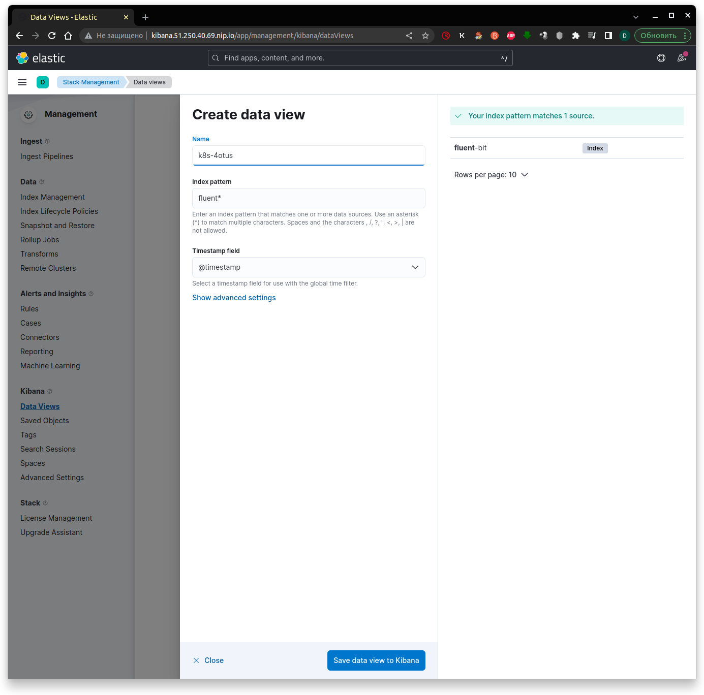

# **Лекция №10: Сервисы централизованного логирования для компонентов Kubernetes и приложений // ДЗ**
> _Сервисы централизованного логирования для Kubernetes_

  
kubernetes-logging

## **Задание:**
Сервисы централизованного логирования для Kubernetes

Цель:
В домашнем задании развернем сервисы для централизованного логирования (EFK/Loki) внутри Kubernetes, научимся отправлять туда структурированные логи продукта и инфраструктурных компонентов, рассмотрим способы визуализировать информацию из логов

Описание/Пошаговая инструкция выполнения домашнего задания:
Все действия описаны в методическом указании.

Критерии оценки:
0 б. - задание не выполнено
1 б. - задание выполнено
2 б. - выполнены все дополнительные задания

---

## **Выполнено:**

### 1. Подготовка Kubernetes кластера

- Поднимаем кластер k8s в yandex-cloud со следующими параметрами:
  - Как минимум 1 нода типа `standard-v2` в группе узлов `default-pool`
  - Как минимум 3 ноды типа `standard-v2` в группе узлов `infra-pool`
~~~bash
cd terraform-k8s
terraform init
terraform plan
terraform apply
~~~

~~~bash
yc managed-kubernetes cluster list-node-groups k8s-4otus
yc managed-kubernetes node-group list
~~~
~~~
+----------------------+----------------------+--------------+----------------------+---------------------+---------+------+
|          ID          |      CLUSTER ID      |     NAME     |  INSTANCE GROUP ID   |     CREATED AT      | STATUS  | SIZE |
+----------------------+----------------------+--------------+----------------------+---------------------+---------+------+
| cat923baqsdrsiilosoh | cate3n1s67rc1lnmknbg | infra-pool   | cl1a1v5ptf3j9fo85vat | 2023-02-25 13:27:54 | RUNNING |    3 |
| catj1ipforjm4reolmda | cate3n1s67rc1lnmknbg | default-pool | cl13es62d7a7s7q9dfgn | 2023-02-25 13:27:54 | RUNNING |    1 |
+----------------------+----------------------+--------------+----------------------+---------------------+---------+------+
~~~

В результате должна получиться следующая конфигурация кластера:
~~~bash
kubectl get nodes -o wide
~~~

~~~
NAME                        STATUS   ROLES    AGE     VERSION   INTERNAL-IP   EXTERNAL-IP     OS-IMAGE             KERNEL-VERSION      CONTAINER-RUNTIME
cl13es62d7a7s7q9dfgn-ewuh   Ready    <none>   2m54s   v1.23.6   10.130.0.25   51.250.43.45    Ubuntu 20.04.4 LTS   5.4.0-124-generic   containerd://1.6.7
cl1a1v5ptf3j9fo85vat-aven   Ready    <none>   2m55s   v1.23.6   10.130.0.22   51.250.44.241   Ubuntu 20.04.4 LTS   5.4.0-124-generic   containerd://1.6.7
cl1a1v5ptf3j9fo85vat-ehif   Ready    <none>   2m57s   v1.23.6   10.130.0.13   51.250.45.6     Ubuntu 20.04.4 LTS   5.4.0-124-generic   containerd://1.6.7
cl1a1v5ptf3j9fo85vat-upaz   Ready    <none>   2m50s   v1.23.6   10.130.0.14   51.250.38.122   Ubuntu 20.04.4 LTS   5.4.0-124-generic   containerd://1.6.7
~~~

Выведем перечень всех нод из `infra-pool` 
~~~bash
yc managed-kubernetes node-group list-nodes infra-pool
~~~

Пометим ноды `infra-pool` тейнтом `node-role=infra:NoSchedule` 
~~~bash
kubectl taint nodes cl1a1v5ptf3j9fo85vat-aven node-role=infra:NoSchedule
kubectl taint nodes cl1a1v5ptf3j9fo85vat-ehif node-role=infra:NoSchedule
kubectl taint nodes  cl1a1v5ptf3j9fo85vat-upaz node-role=infra:NoSchedule
~~~

Проверим `taints` на нодах
~~~bash
kubectl get nodes -o json | jq '.items[].spec.taints'
~~~
~~~
null
[
  {
    "effect": "NoSchedule",
    "key": "node-role",
    "value": "infra"
  }
]
[
  {
    "effect": "NoSchedule",
    "key": "node-role",
    "value": "infra"
  }
]
[
  {
    "effect": "NoSchedule",
    "key": "node-role",
    "value": "infra"
  }
]

~~~

### 2. Установка HipsterShop

Для начала, установим в Kubernetes кластер уже знакомый нам HipsterShop.
~~~bash
kubectl create ns microservices-demo
kubectl apply -f https://raw.githubusercontent.com/express42/otus-platform-snippets/master/Module-02/Logging/microservices-demo-without-resources.yaml \
-n microservices-demo
~~~

Проверим, что все pod развернулись на ноде из default-pool:
~~~bash
kubectl get pods -n microservices-demo -o wide
~~~
~~~
NAME                                     READY   STATUS             RESTARTS        AGE     IP              NODE                        NOMINATED NODE   READINESS GATES
adservice-548889999f-25vd2               0/1     ImagePullBackOff   0               3m53s   10.112.130.15   cl13es62d7a7s7q9dfgn-ewuh   <none>           <none>
cartservice-75cc479cdd-f2dgx             1/1     Running            2 (2m42s ago)   3m54s   10.112.130.10   cl13es62d7a7s7q9dfgn-ewuh   <none>           <none>
checkoutservice-699758c6d9-t25zv         1/1     Running            0               3m55s   10.112.130.5    cl13es62d7a7s7q9dfgn-ewuh   <none>           <none>
currencyservice-7fc9cfc9cf-2bn76         1/1     Running            0               3m54s   10.112.130.11   cl13es62d7a7s7q9dfgn-ewuh   <none>           <none>
emailservice-6c8d49f789-nhjpb            1/1     Running            0               3m55s   10.112.130.4    cl13es62d7a7s7q9dfgn-ewuh   <none>           <none>
frontend-5b8c8bf745-zfp2t                1/1     Running            0               3m55s   10.112.130.7    cl13es62d7a7s7q9dfgn-ewuh   <none>           <none>
loadgenerator-799c7664dd-z6l6f           1/1     Running            4 (118s ago)    3m54s   10.112.130.12   cl13es62d7a7s7q9dfgn-ewuh   <none>           <none>
paymentservice-557f767677-4c99z          1/1     Running            0               3m54s   10.112.130.8    cl13es62d7a7s7q9dfgn-ewuh   <none>           <none>
productcatalogservice-7b69d99c89-4nkdv   1/1     Running            0               3m54s   10.112.130.9    cl13es62d7a7s7q9dfgn-ewuh   <none>           <none>
recommendationservice-7f78d66cc9-4r4jq   1/1     Running            0               3m55s   10.112.130.6    cl13es62d7a7s7q9dfgn-ewuh   <none>           <none>
redis-cart-fd8d87cdb-rrhjf               1/1     Running            0               3m53s   10.112.130.14   cl13es62d7a7s7q9dfgn-ewuh   <none>           <none>
shippingservice-64999cdc59-s2w45         1/1     Running            0               3m54s   10.112.130.13   cl13es62d7a7s7q9dfgn-ewuh   <none>           <none>
~~~

### 3. Установка EFK стека | Helm charts

Начнем с "классического" набора инструментов (ElasticSearch, Fluent Bit, Kibana) и "классического" способа его установки в Kubernetes кластер (Helm).
Рекомендуемый репозиторий с Helm chart для ElasticSearch и Kibana на текущий момент - [https://github.com/elastic/helm-charts](https://github.com/elastic/helm-charts)
Добавим его:
~~~bash
helm repo add elastic https://helm.elastic.co
~~~
И установим нужные нам компоненты, для начала - без какой-либо дополнительной настройки:
~~~bash
kubectl create ns observability
# ElasticSearch
helm upgrade --install elasticsearch elastic/elasticsearch --namespace observability
# Kibana
helm upgrade --install kibana elastic/kibana --namespace observability
# Fluent Bit
helm upgrade --install fluent-bit stable/fluent-bit --namespace observability
~~~

И ловим `403` - `No comments...`
Идем другим путем:
~~~bash
kubectl create ns observability
#helm repo remove elastic 
helm repo add bitnami https://charts.bitnami.com/bitnami
helm repo update bitnami
# ElasticSearch
helm upgrade --install elasticsearch bitnami/elasticsearch --namespace observability
# Kibana
helm upgrade --install kibana bitnami/kibana --namespace observability
~~~

Смотрим, что получилось
~~~bash
kubectl get pods -n observability -o wide
~~~

Всё поставилось так же, на ту же первую ноду `cl13es62d7a7s7q9dfgn-ewuh`
~~~
NAME                           READY   STATUS    RESTARTS   AGE     IP              NODE                        NOMINATED NODE   READINESS GATES
elasticsearch-coordinating-0   0/1     Running   0          2m11s   10.112.131.18   cl13es62d7a7s7q9dfgn-ewuh  <none>           <none>
elasticsearch-coordinating-1   0/1     Running   0          2m11s   10.112.131.20   cl13es62d7a7s7q9dfgn-ewuh  <none>           <none>
elasticsearch-data-0           0/1     Running   0          2m11s   10.112.131.23   cl13es62d7a7s7q9dfgn-ewuh  <none>           <none>
elasticsearch-data-1           0/1     Running   0          2m11s   10.112.131.21   cl13es62d7a7s7q9dfgn-ewuh  <none>           <none>
elasticsearch-ingest-0         0/1     Running   0          2m11s   10.112.131.17   cl13es62d7a7s7q9dfgn-ewuh  <none>           <none>
elasticsearch-ingest-1         0/1     Running   0          2m11s   10.112.131.19   cl13es62d7a7s7q9dfgn-ewuh  <none>           <none>
elasticsearch-master-0         0/1     Running   0          2m11s   10.112.131.22   cl13es62d7a7s7q9dfgn-ewuh  <none>           <none>
elasticsearch-master-1         0/1     Running   0          2m11s   10.112.131.24   cl13es62d7a7s7q9dfgn-ewuh  <none>           <none>
fluent-bit-bpr5l               1/1     Running   0          12m     10.112.131.16   cl13es62d7a7s7q9dfgn-ewuh  <none>           <none>
~~~

Создадим файл `elasticsearch.values.yaml` , будем указывать в этом файле нужные нам values.
Для начала, обратимся к файлу `values.yaml` в и найдем там ключ `tolerations`.

Мы помним, что ноды из infra-pool имеют taint node-role=infra:NoSchedule . Давайте разрешим ElasticSearch запускаться на данных нодах
> elasticsearch.values.yaml
~~~yaml
master:
  tolerations: &tolerations
    - key: node-role
      operator: Equal
      value: infra
      effect: NoSchedule

data:
  tolerations:
    *tolerations

coordinating:
  tolerations:
    *tolerations

ingest:
  tolerations:
    *tolerations

metrics:
  tolerations:
    *tolerations
~~~

Обновим установку:
~~~bash
helm upgrade --install elasticsearch bitnami/elasticsearch --namespace observability \
-f elasticsearch.values.yaml
~~~

Теперь ElasticSearch может запускаться на нодах из `infra-pool`, но это не означает, что он должен это делать.
Исправим этот момент и добавим в `elasticsearch.values.yaml` `NodeSelector`, определяющий, на каких нодах мы можем запускать наши
pod.
~~~bash
yc managed-kubernetes node-group list
~~~
~~~yaml
master:
  nodeSelector: &nodeSelector
    yandex.cloud/node-group-id: cat923baqsdrsiilosoh
~~~

Корректируем соответственно `elasticsearch.values.yaml` для всех компонент `ElasticSearch` и перезапускаем деплой: 
~~~bash
kubectl create ns observability
helm uninstall elasticsearch --namespace observability
helm upgrade --install elasticsearch bitnami/elasticsearch --namespace observability \
-f elasticsearch.values.yaml
~~~

Смотрим, что получилось:
~~~bash
kubectl get pods -n observability -o wide -l app.kubernetes.io/component=master
~~~
~~~
NAME                     READY   STATUS    RESTARTS   AGE   IP              NODE                        NOMINATED NODE   READINESS GATES
elasticsearch-master-0   1/1     Running   0          20m   10.112.129.12   cl1a1v5ptf3j9fo85vat-aven   <none>           <none>
elasticsearch-master-1   1/1     Running   0          22m   10.112.128.11   cl1a1v5ptf3j9fo85vat-ehif   <none>           <none>
elasticsearch-master-2   1/1     Running   0          24m   10.112.131.8    cl1a1v5ptf3j9fo85vat-upaz   <none>           <none>
~~~

### 4. Установка nginx-ingress | Самостоятельное задание

~~~bash
yc managed-kubernetes cluster list
~~~
~~~bash
helm repo add ingress-nginx https://kubernetes.github.io/ingress-nginx
helm repo update ingress-nginx
~~~
~~~bash
kubectl create ns nginx-ingress
helm upgrade --install nginx-ingress-release ingress-nginx/ingress-nginx --namespace=nginx-ingress --version="4.4.2"
~~~
~~~bash
kubectl get svc -n nginx-ingress
~~~
~~~bash
kubectl get svc -n observability
~~~
~~~bash
# Kibana
helm upgrade --install kibana bitnami/kibana --namespace observability \
  --set "elasticsearch.hosts[0]=elasticsearch,elasticsearch.port=9200" -f kibana.values.yaml
~~~

Попробуем создать `index pattern` , и увидим, что в ElasticSearch пока что не обнаружено никаких данных:
)

Посмотрим в логи решения, которое отвечает за отправку логов (Fluent Bit) и увидим следующие строки:
~~~bash
kubectl logs -n observability -l app=fluent-bit --tail 3
~~~
~~~
[2023/02/25 19:55:40] [ warn] net_tcp_fd_connect: getaddrinfo(host='fluentd'): Name or service not known
[2023/02/25 19:55:40] [error] [out_fw] no upstream connections available
[2023/02/25 19:55:40] [ warn] [engine] failed to flush chunk '1-1677333615.980802731.flb', retry in 239 seconds: task_id=22, input=tail.0 > output=forward.0
~~~

### 5.Fluent Bit

Попробуем исправить проблему. Создадим файл `fluentbit.values.yaml` и добавим туда:
~~~yaml
config:
  outputs: |
    [OUTPUT]
        Name  es
        Match *
        Host  elasticsearch
        Port  9200

nodeSelector: &nodeSelector
  yandex.cloud/node-group-id: cat923baqsdrsiilosoh

tolerations: &tolerations
  - key: node-role
    operator: Equal
    value: infra
    effect: NoSchedule
~~~

Запускаем деплой `NotDeprecated` версии чарта: 
~~~bash
helm repo add fluent https://fluent.github.io/helm-charts
helm upgrade --install fluent-bit fluent/fluent-bit \
 --namespace observability -f fluentbit.values.yaml
~~~

Ловим в подах `fluent` ошибки 2х видов:
~~~
{"error":{"root_cause":[{"type":"illegal_argument_exception","reason":"Action/metadata line [1] contains an unknown parameter [_type]"}],"type":"illegal_argument_exception","reason":"Action/metadata line [1] contains an unknown parameter [_type]"},"status":400}
~~~
~~~
[error] [engine] chunk '1-1677401624.242975823.flb' cannot be retried: task_id=0, input=tail.0 > output=es.0 
~~~

Приводим `fluentbit.values.yaml` в соответствии с рекомендациями:
>https://docs.fluentbit.io/manual/pipeline/outputs/elasticsearch
 
> https://github.com/fluent/fluent-bit/issues/4386.you

к виду:
~~~yaml
config:
  outputs: |
    [OUTPUT]
        Name  es
        Match *
        Host  elasticsearch
        Port  9200
        Suppress_Type_Name On
        Replace_Dots    On

nodeSelector: &nodeSelector
  yandex.cloud/node-group-id: cat923baqsdrsiilosoh

tolerations: &tolerations
  - key: node-role
    operator: Equal
    value: infra
    effect: NoSchedule
~~~

и производим передеплой `fluent-bit`:
~~~bash
helm upgrade --install fluent-bit fluent/fluent-bit \
--namespace observability -f fluentbit.values.yaml
~~~

Попробуем повторно создать 'index pattern' . В этот раз ситуация изменилась, и какие-то индексы в ElasticSearch уже есть:

git 
# **Полезное:**

- https://registry.tfpla.net/providers/yandex-cloud/yandex/latest/docs/resources/kubernetes_node_group#node_taints
- https://cloud.yandex.ru/docs/managed-kubernetes/api-ref/NodeGroup/
- https://kubernetes.io/docs/concepts/scheduling-eviction/topology-spread-constraints/#spread-constraints-for-pods
- https://blog.kubecost.com/blog/kubernetes-taints/
- https://docs.comcloud.xyz/

~~~bash
yc managed-kubernetes cluster stop k8s-4otus
~~~

~~~bash
yc managed-kubernetes cluster start k8s-4otus
~~~

