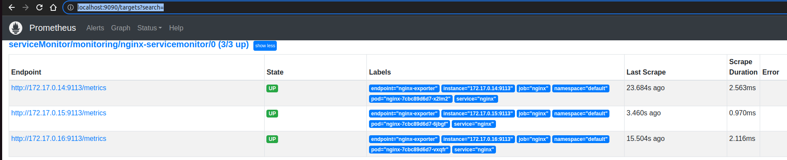
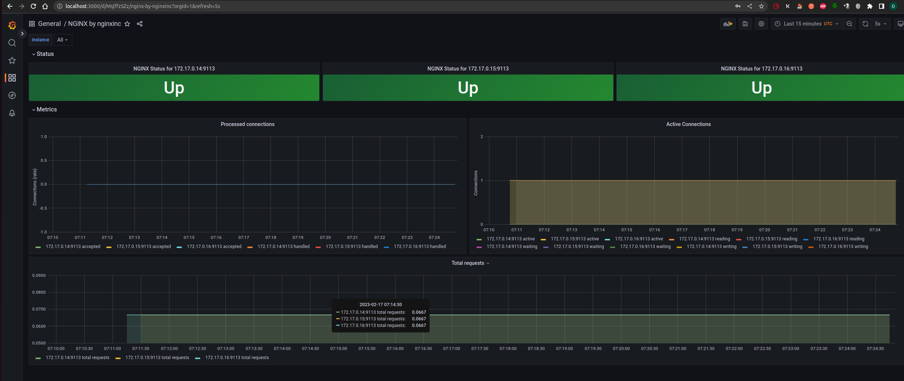

# **Лекция №9: Мониторинг компонентов кластера и приложений, работающих в нем // ДЗ**
> _Мониторинг сервиса в кластере k8s_

  
kubernetes-monitoring

## **Задание:**
Мониторинг приложения в кластере

Цель:
В данном дз студенту установят систему мониторинга Prometheus в кластер. Научатся конфигурировать Prometheus для мониторинга как самого кластера, так и приложений которые в нем работают.

Описание/Пошаговая инструкция выполнения домашнего задания:
Все действия описаны в методическом указании.

Критерии оценки:
0 б. - задание не выполнено
1 б. - задание выполнено
2 б. - выполнены все дополнительные задания

---

## **Выполнено:**

- Запускаем minikube
~~~bash
minikube delete && minikube start --kubernetes-version=v1.23.0 --memory=6g --bootstrapper=kubeadm --extra-config=kubelet.authentication-token-webhook=true --extra-config=kubelet.authorization-mode=Webhook --extra-config=scheduler.bind-address=0.0.0.0 --extra-config=controller-manager.bind-address=0.0.0.0
~~~

- Ставим `prometheus-operator` через  `kubectl apply` из [офф. репозитория](https://github.com/prometheus-operator/kube-prometheus)
(Bring`em on!)
~~~bash
cd ./kube-prometheus
# Create the namespace and CRDs, and then wait for them to be available before creating the remaining resources
# Note that due to some CRD size we are using kubectl server-side apply feature which is generally available since kubernetes 1.22.
# If you are using previous kubernetes versions this feature may not be available and you would need to use kubectl create instead.
kubectl apply --server-side -f manifests/setup
kubectl wait \
--for condition=Established \
--all CustomResourceDefinition \
--namespace=monitoring
kubectl apply -f manifests/
~~~

- Готовим манифест для `nginx` и применяем:
~~~bash
kubectl apply -f ./nginx
~~~

- Проверяем, что прометею доступны эндпойнты:
~~~bash
kubectl --namespace monitoring port-forward svc/prometheus-k8s 9090
~~~

- Заходим в графану
~~~bash
kubectl --namespace monitoring port-forward svc/grafana 3000
~~~
[http://localhost:3000/](http://localhost:3000/)

- Добавляем [Official dashboard for NGINX Prometheus exporter](https://grafana.com/grafana/dashboards/11199-nginx/)

# **Полезное:**

- [prometheus-operator / kube-prometheus](https://github.com/prometheus-operator/kube-prometheus)
- [Модуль ngx_http_stub_status_module](https://nginx.org/ru/docs/http/ngx_http_stub_status_module.html)
- [Устройство и механизм работы Prometheus Operator в Kubernetes](https://habr.com/ru/company/flant/blog/353410/)

