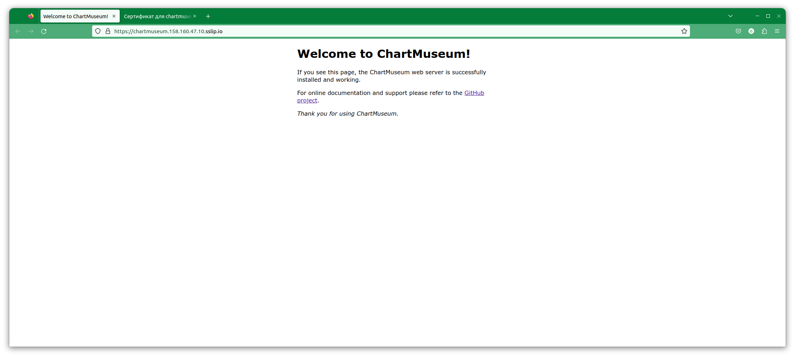
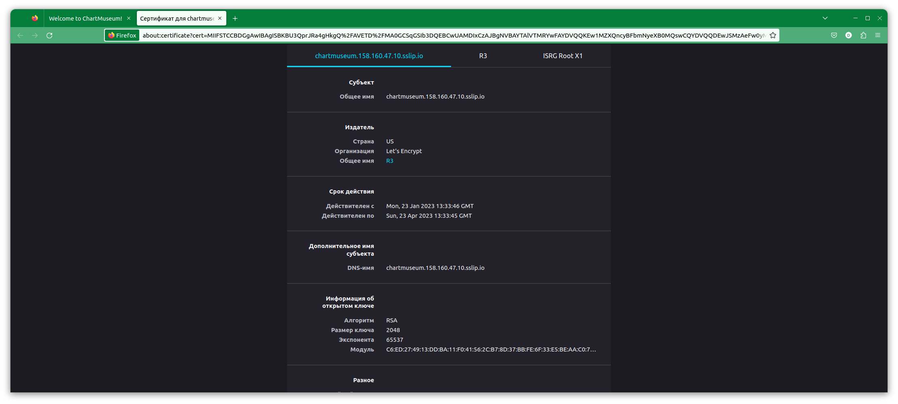
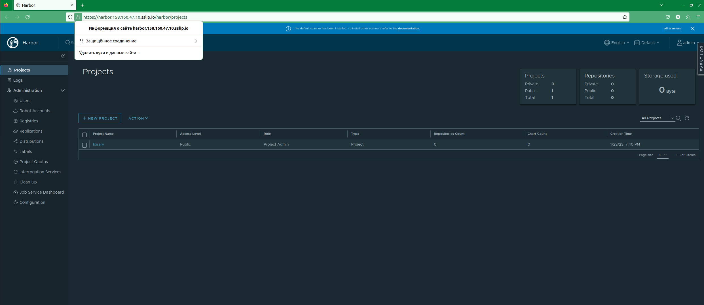
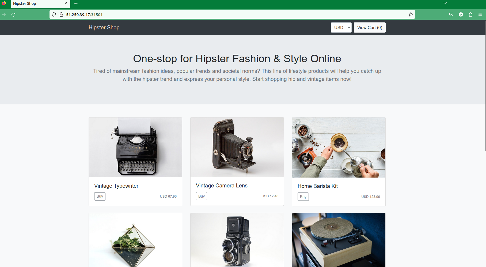
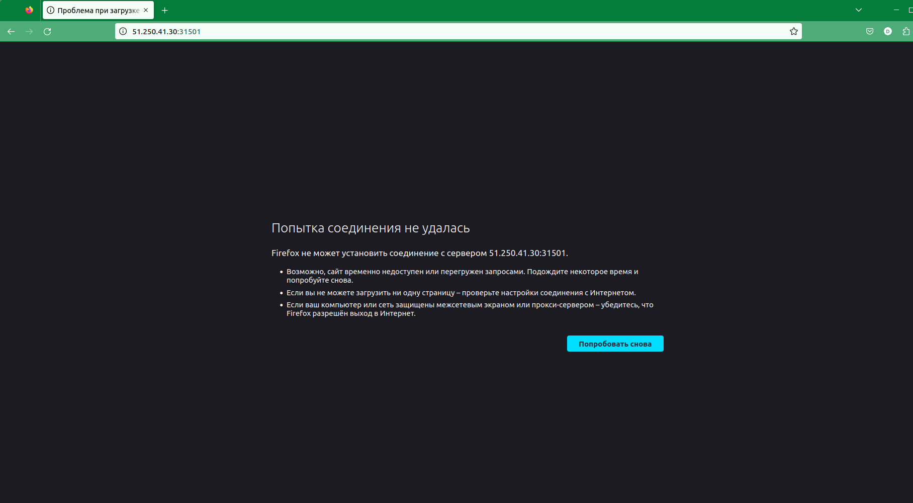
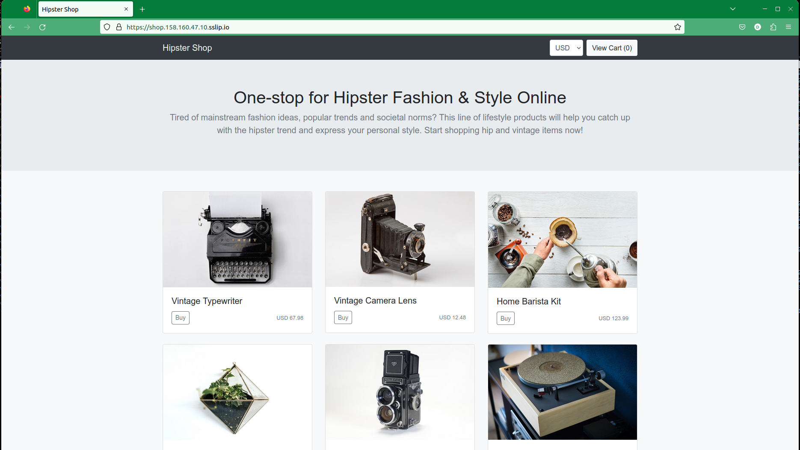

# **Лекция №7: Шаблонизация манифестов. Helm и его аналоги (Jsonnet, Kustomize) // ДЗ**
> _Шаблонизация манифестов Kubernetes_

  
kubernetes-templating

## **Задание:**
Шаблонизация манифестов приложения, использование Helm, kustomize, helmfile, jsonnet. Установка community Helm charts
Цель:
В данном дз студенты научатся использовать менеджер Helm3, научатся писать свои helm манифесты. Научатся управлять релизами при помощи helm.
Описание/Пошаговая инструкция выполнения домашнего задания:
Все действия описаны в методическом указании.

Критерии оценки:

0 б. - задание не выполнено
1 б. - задание выполнено
2 б. - выполнены все дополнительные задания

---

## **Выполнено:**

### 1. Intro

Поднимем кластер k8s
~~~bash
pushd ./terraform-k8s/
#curl https://storage.yandexcloud.net/yandexcloud-yc/install.sh | bash
terraform init
terraform apply --auto-approve
popd
yc managed-kubernetes cluster list
~~~
~~~
+----------------------+-----------+---------------------+---------+---------+-----------------------+---------------------+
|          ID          |   NAME    |     CREATED AT      | HEALTH  | STATUS  |   EXTERNAL ENDPOINT   |  INTERNAL ENDPOINT  |
+----------------------+-----------+---------------------+---------+---------+-----------------------+---------------------+
| cat5n9ukele6r0mhhj42 | k8s-4otus | 2023-01-22 10:29:54 | HEALTHY | RUNNING | https://84.201.131.80 | https://10.128.0.27 |
+----------------------+-----------+---------------------+---------+---------+-----------------------+---------------------+
~~~
~~~bash
kubectl cluster-info
~~~
~~~
Kubernetes control plane is running at https://84.252.131.8
CoreDNS is running at https://84.252.131.8/api/v1/namespaces/kube-system/services/kube-dns:dns/proxy

To further debug and diagnose cluster problems, use 'kubectl cluster-info dump'.
~~~
~~~bash
kubectl version
~~~
~~~
WARNING: This version information is deprecated and will be replaced with the output from kubectl version --short.  Use --output=yaml|json to get the full version.
Client Version: version.Info{Major:"1", Minor:"26", GitVersion:"v1.26.0", GitCommit:"b46a3f887ca979b1a5d14fd39cb1af43e7e5d12d", GitTreeState:"clean", BuildDate:"2022-12-08T19:58:30Z", GoVersion:"go1.19.4", Compiler:"gc", Platform:"linux/amd64"}
Kustomize Version: v4.5.7
Server Version: version.Info{Major:"1", Minor:"23", GitVersion:"v1.23.6", GitCommit:"ad3338546da947756e8a88aa6822e9c11e7eac22", GitTreeState:"clean", BuildDate:"2022-04-14T08:43:11Z", GoVersion:"go1.17.9", Compiler:"gc", Platform:"linux/amd64"}
WARNING: version difference between client (1.26) and server (1.23) exceeds the supported minor version skew of +/-1
~~~

#### Проверяем версию установленного helm
~~~bash
helm version
~~~
~~~
version.BuildInfo{Version:"v3.10.3", GitCommit:"835b7334cfe2e5e27870ab3ed4135f136eecc704", GitTreeState:"clean", GoVersion:"go1.18.9"}
~~~

#### План по установке готовых Helm charts со следующими сервисами:
- [nginx-ingress](https://github.com/helm/charts/tree/master/stable/nginx-ingress) - сервис, обеспечивающий доступ к публичным ресурсам кластера
- [cert-manager](https://github.com/jetstack/cert-manager/tree/master/deploy/charts/cert-manager) - сервис, позволяющий динамически генерировать Let's Encrypt сертификаты для ingress ресурсов
- [chartmuseum](https://github.com/helm/charts/tree/master/stable/chartmuseum) - специализированный репозиторий для хранения helm charts
- [harbor](https://github.com/goharbor/harbor-helm) - хранилище артефактов общего назначения (Docker Registry), поддерживающее helm charts

#### Памятка по использованию Helm
> Создание release:
~~~
$ helm install <chart_name> --name=<release_name> --namespace=<namespace>
$ kubectl get secrets -n <namespace> | grep <release_name>
sh.helm.release.v1.<release_name>.v1 helm.sh/release.v1 1 115m
~~~

> Обновление release:
~~~
$ helm upgrade <release_name> <chart_name> --namespace=<namespace>
$ kubectl get secrets -n <namespace> | grep <release_name>
sh.helm.release.v1.<release_name>.v1 helm.sh/release.v1 1 115m
sh.helm.release.v1.<release_name>.v2 helm.sh/release.v1 1 56m
~~~

> Создание или обновление release:
~~~
$ helm upgrade --install <release_name> <chart_name> --namespace=<namespace>
$ kubectl get secrets -n <namespace> | grep <release_name>
sh.helm.release.v1.<release_name>.v1 helm.sh/release.v1 1 115m
sh.helm.release.v1.<release_name>.v2 helm.sh/release.v1 1 56m
sh.helm.release.v1.<release_name>.v3 helm.sh/release.v1 1 5s
~~~

#### Add helm repo
Добавим репозиторий helm/stable. По умолчанию в Helm 3 не установлен репозиторий stable.
~~~bash
helm repo add stable https://charts.helm.sh/stable
~~~
~~~
"stable" has been added to your repositories
~~~
~~~bash
helm repo list
~~~
~~~
stable                  https://charts.helm.sh/stable     
~~~

### 2. Nginx-ingress

~~~bash
kubectl create ns nginx-ingress
~~~

~~~bash
helm upgrade --install nginx-ingress stable/nginx-ingress --wait \
 --namespace=nginx-ingress \
 --version=1.41.3
~~~
~~~
*******************************************************************************************************
* DEPRECATED, please use https://github.com/kubernetes/ingress-nginx/tree/master/charts/ingress-nginx *
*******************************************************************************************************
~~~
~~~bash
helm list --all-namespaces
NAME            NAMESPACE       REVISION        UPDATED                                 STATUS          CHART                   APP VERSION
nginx-ingress   nginx-ingress   1               2023-01-22 14:40:58.073431576 +0300 MSK failed  nginx-ingress-1.41.3    v0.34.1 
~~~
~~~bash
kubectl describe pod nginx-ingress-controller-65845897bc-7p82x -n nginx-ingress  
~~~
~~~
│ Events:                                                                                                                                                                                                                                                                        │
│   Type     Reason     Age   From               Message                                                                                                                                                                                                                         │
│   ----     ------     ----  ----               -------                                                                                                                                                                                                                         │
│   Normal   Scheduled  21s   default-scheduler  Successfully assigned nginx-ingress/nginx-ingress-controller-65845897bc-6gv4w to cl1hviaelv39ku1b4r6a-ufav                                                                                                                      │
│   Normal   Pulled     20s   kubelet            Container image "us.gcr.io/k8s-artifacts-prod/ingress-nginx/controller:v0.34.1" already present on machine                                                                                                                      │
│   Normal   Created    20s   kubelet            Created container nginx-ingress-controller                                                                                                                                                                                      │
│   Normal   Started    20s   kubelet            Started container nginx-ingress-controller                                                                                                                                                                                      │
│   Warning  Unhealthy  1s    kubelet            Readiness probe failed: HTTP probe failed with statuscode: 500                                                                                                                                                                  │
│   Warning  Unhealthy  1s    kubelet            Liveness probe failed: HTTP probe failed with statuscode: 500  
~~~
~~~bash
helm uninstall nginx-ingress --namespace=nginx-ingress
~~~

~~~bash
helm repo add ingress-nginx https://kubernetes.github.io/ingress-nginx
helm repo update ingress-nginx
~~~
~~~bash
helm upgrade --install nginx-ingress-release ingress-nginx/ingress-nginx --namespace=nginx-ingress --version="4.4.2"
~~~
~~~bash
kubectl get services -n nginx-ingress
~~~
~~~
NAME                                                       TYPE           CLUSTER-IP      EXTERNAL-IP    PORT(S)                      AGE   SELECTOR
nginx-ingress-release-ingress-nginx-controller             LoadBalancer   10.96.252.181   51.250.64.17   80:31382/TCP,443:30757/TCP   22m   app.kubernetes.io/component=controller,app.kubernetes.io/instance=nginx-ingress-release,app.kubernetes.io/name=ingress-nginx
nginx-ingress-release-ingress-nginx-controller-admission   ClusterIP      10.96.168.224   <none>         443/TCP                      22m   app.kubernetes.io/component=controller,app.kubernetes.io/instance=nginx-ingress-release,app.kubernetes.io/name=ingress-nginx
~~~

~~~bash
helm uninstall nginx-ingress-release -n nginx-ingress
~~~

### 3. Cert-manager
~~~bash
helm repo add jetstack https://charts.jetstack.io
helm repo update jetstack
~~~
~~~bash
#Install CustomResourceDefinitions
kubectl apply -f https://github.com/cert-manager/cert-manager/releases/download/v1.11.0/cert-manager.crds.yaml
~~~
~~~bash
helm install \
cert-manager jetstack/cert-manager \
--namespace cert-manager \
--create-namespace \
--version v1.11.0
~~~
~~~bash
helm list --all-namespaces
~~~
~~~
NAME                    NAMESPACE       REVISION        UPDATED                                 STATUS          CHART                   APP VERSION
cert-manager            cert-manager    1               2023-01-22 19:13:09.728801632 +0300 MSK deployed        cert-manager-v1.11.0    v1.11.0    
nginx-ingress-release   nginx-ingress   1               2023-01-22 18:52:17.884153512 +0300 MSK deployed        ingress-nginx-4.4.2     1.5.1  
~~~
~~~bash
kubectl --namespace nginx-ingress get services -o wide
~~~
~~~
NAME                                                       TYPE           CLUSTER-IP      EXTERNAL-IP     PORT(S)                      AGE   SELECTOR
nginx-ingress-release-ingress-nginx-controller             LoadBalancer   10.96.168.9     158.160.47.10   80:30414/TCP,443:31671/TCP   10h   app.kubernetes.io/component=controller,app.kubernetes.io/instance=nginx-ingress-release,app.kubernetes.io/name=ingress-nginx
nginx-ingress-release-ingress-nginx-controller-admission   ClusterIP      10.96.169.164   <none>          443/TCP                      10h   app.kubernetes.io/component=controller,app.kubernetes.io/instance=nginx-ingress-release,app.kubernetes.io/name=ingress-nginx
~~~

###  4. chartmuseum

~~~bash
yc vpc address list
~~~
~~~
+----------------------+------+---------------+----------+-------+
|          ID          | NAME |    ADDRESS    | RESERVED | USED  |
+----------------------+------+---------------+----------+-------+
| b0c0a0bvjkq66v1u45k2 |      | 51.250.45.29  | false    | true  |
| b0ckbt916vmaut8khrdv |      | 51.250.38.192 | false    | true  |
| e9bmm0jfbgv7eqjba2gc |      | 158.160.47.10 | false    | true  |
| e9bqp638auh43k70ivdp |      | 51.250.64.17  | false    | true  |
+----------------------+------+---------------+----------+-------+
~~~
~~~bash
yc vpc address update --id e9bmm0jfbgv7eqjba2gc --reserved
~~~

Создадим файл `values.yaml` для chartmuseum
~~~yaml
---
ingress:
  enabled: true
  annotations:
    kubernetes.io/ingress.class: nginx
    kubernetes.io/tls-acme: "true"
    cert-manager.io/cluster-issuer: letsencrypt-prod
    cert-manager.io/acme-challenge-type: http01
  hosts:
    - name: chartmuseum.158.160.47.10.sslip.io
      path: /
      tls: true
      tlsSecret: chartmuseum.158.160.47.10.sslip.io
env:
  open:
    DISABLE_API: false
~~~

Запустим установку `chartmuseum`
~~~bash
kubectl create ns chartmuseum
kubectl apply -f cert-manager/acme-issuer.yaml
~~~
~~~bash
helm repo add chartmuseum https://chartmuseum.github.io/charts
helm repo update chartmuseum
~~~
~~~bash
#helm upgrade --install chartmuseum-release stable/chartmuseum --wait \
# --namespace=chartmuseum \
# --version=2.13.2 \
# -f chartmuseum/values.yaml
helm upgrade --install chartmuseum-release chartmuseum/chartmuseum  --wait \
 --namespace=chartmuseum \
  --version 3.1.0 \
  -f chartmuseum/values.yaml
~~~

Проверим, что `release chartmuseum` установился:
~~~bash
helm ls -n chartmuseum
~~~
~~~
NAME                    NAMESPACE       REVISION        UPDATED                                 STATUS          CHART                   APP VERSION
chartmuseum-release     chartmuseum     1               2023-01-23 00:19:39.373595004 +0300 MSK deployed        chartmuseum-3.1.0       0.13.1 
~~~

Helm 3 хранит информацию в `secrets`
~~~bash
kubectl get secrets -n chartmuseum
~~~
~~~
NAME                                        TYPE                                  DATA   AGE
chartmuseum-release                         Opaque                                0      2m4s
chartmuseum.51.250.64.17.sslip.io-qhktx     Opaque                                1      2m3s
default-token-5krfx                         kubernetes.io/service-account-token   3      37m
sh.helm.release.v1.chartmuseum-release.v1   helm.sh/release.v1                    1      2m4s
~~~

Проверяем установку в соответствии с критериями:
- Chartmuseum доступен по URL [https://chartmuseum.158.160.47.10.sslip.io/](https://chartmuseum.158.160.47.10.sslip.io/)
- Сертификат для данного URL валиден

###  5. harbor

Установка
~~~bash
helm repo add harbor https://helm.goharbor.io
helm repo update harbor
kubectl create ns harbor
~~~

Правим `harbor/values.yaml` в части 'ingress'
~~~yaml
expose:
  type: ingress
  tls:
    enabled: true
    certSource: secret
    secret:
      secretName: harbor-ingress-tls
  ingress:
    hosts:
      core: harbor.158.160.47.10.sslip.io
    controller: nginx
    annotations:
      kubernetes.io/tls-acme: "true"
      cert-manager.io/cluster-issuer: letsencrypt-prod
      cert-manage.io/acme-challenge-type: http01
      kubernetes.io/ingress.class: nginx
externalURL: https://harbor.158.160.47.10.sslip.io/

notary:
  enabled: false
~~~ 
~~~bash
helm search repo harbor -l
helm search repo harbor
~~~
~~~bash
helm upgrade --install harbor harbor/harbor --wait --namespace=harbor --version=1.11.0 -f ./harbor/values.yaml
~~~
~~~bash
helm ls -n harbor
~~~
~~~
NAME    NAMESPACE       REVISION        UPDATED                                 STATUS          CHART           APP VERSION
harbor  harbor          1               2023-01-23 19:39:19.711771204 +0300 MSK deployed        harbor-1.11.0   2.7.0    
~~~
~~~bash
kubectl get secrets -n harbor -l owner=helm
~~~
~~~
NAME                           TYPE                 DATA   AGE
sh.helm.release.v1.harbor.v1   helm.sh/release.v1   1      6m8s
~~~

Проверяем установку в соответствии с критериями:
- harbor доступен по URL [https://harbor.158.160.47.10.sslip.io/](https://harbor.158.160.47.10.sslip.io/)
- Сертификат для данного URL валиден

### Используем helmfile | Задание со ⭐

Опишем установку `nginx-ingress`, `cert-manager` и `harbor` в [helmfile](./helmfile/helmfile.yaml)
~~~bash
wget https://github.com/helmfile/helmfile/releases/download/v0.150.0/helmfile_0.150.0_linux_amd64.tar.gz
tar xzvf helmfile_0.150.0_linux_amd64.tar.gz -C ~/bin
rm -f helmfile_0.150.0_linux_amd64.tar.gz
chmod +x ~/bin/helmfile
helm plugin install https://github.com/databus23/helm-diff
~~~
~~~bash
cd helmfile
helmfile apply
~~~ 

###  6. Создаем свой helm chart
Стандартными средствами helm инициализируем структуру директории с содержимым будущего helm chart
~~~bash
helm create hipster-shop
~~~
Мы будем создавать chart для приложения с нуля, поэтому удалим `values.yaml` и содержимое `templates`
~~~bash
rm ./hipster-shop/values.yaml
rm -rf ./hipster-shop/templates/*
wget https://raw.githubusercontent.com/express42/otus-platform-snippets/master/Module-04/05-Templating/manifests/all-hipster-shop.yaml \
-O ./hipster-shop/templates/all-hipster-shop.yaml
~~~

В целом, helm chart уже готов, можем попробовать установить его:
~~~bash
kubectl create ns hipster-shop
helm upgrade --install hipster-shop-release hipster-shop --namespace hipster-shop
helm ls -n hipster-shop
~~~
~~~
NAME                    NAMESPACE       REVISION        UPDATED                                 STATUS          CHART                   APP VERSION
hipster-shop-release    hipster-shop    1               2023-01-25 20:19:37.006630313 +0300 MSK deployed        hipster-shop-0.1.0      1.16.0     
~~~
~~~bash
kubectl get services -n hipster-shop
~~~
~~~
NAME                    TYPE        CLUSTER-IP      EXTERNAL-IP   PORT(S)        AGE
adservice               ClusterIP   10.96.232.52    <none>        9555/TCP       34s
cartservice             ClusterIP   10.96.221.153   <none>        7070/TCP       34s
checkoutservice         ClusterIP   10.96.143.68    <none>        5050/TCP       34s
currencyservice         ClusterIP   10.96.235.129   <none>        7000/TCP       34s
emailservice            ClusterIP   10.96.224.110   <none>        5000/TCP       34s
frontend                NodePort    10.96.245.36    <none>        80:31501/TCP   34s
paymentservice          ClusterIP   10.96.180.27    <none>        50051/TCP      34s
productcatalogservice   ClusterIP   10.96.141.187   <none>        3550/TCP       34s
recommendationservice   ClusterIP   10.96.236.85    <none>        8080/TCP       34s
redis-cart              ClusterIP   10.96.193.199   <none>        6379/TCP       34s
shippingservice         ClusterIP   10.96.198.69    <none>        50051/TCP      34s
~~~
~~~bash
kubectl get nodes -o wide
~~~
~~~
NAME                        STATUS   ROLES    AGE     VERSION   INTERNAL-IP   EXTERNAL-IP     OS-IMAGE             KERNEL-VERSION      CONTAINER-RUNTIME
cl1sdl9jmenq18nt5jbd-ahak   Ready    <none>   7d21h   v1.23.6   10.130.0.15   51.250.44.80    Ubuntu 20.04.4 LTS   5.4.0-124-generic   containerd://1.6.7
cl1sdl9jmenq18nt5jbd-aled   Ready    <none>   7d21h   v1.23.6   10.130.0.6    51.250.43.131   Ubuntu 20.04.4 LTS   5.4.0-124-generic   containerd://1.6.7
~~~
~~~bash
kubectl get svc -A | grep NodePort
~~~
~~~
hipster-shop    frontend                                                   NodePort       10.96.245.36    <none>          80:31501/TCP                 14m
~~~

Проверяем работу `UI`

Вынесем все что связано с frontend в отдельный helm chart.
~~~bash
helm create frontend
~~~

Аналогично чарту hipster-shop удалим файл `values.yaml` и файлы в
директории `templates` , создаваемые по умолчанию.
~~~bash
rm -rf frontend/templates
rm -f frontend/values.yaml
~~~

Выделим из файла `all-hipster-shop.yaml` манифесты для установки микросервиса `frontend`.
В директории `templates` чарта `frontend` создадим файлы:
- `deployment.yaml` - должен содержать соответствующую часть из файла `all-hipster-shop.yaml`
- `service.yaml` - должен содержать соответствующую часть из файла `allhipster-shop.yaml`
- `ingress.yaml` - создадим самостоятельно.

Переустановим 'hipster-shop'

~~~bash
helm upgrade --install hipster-shop-release hipster-shop --namespace hipster-shop
~~~
~~~bash
helm ls -n hipster-shop
~~~
~~~
NAME                    NAMESPACE       REVISION        UPDATED                                 STATUS          CHART                   APP VERSION
hipster-shop-release    hipster-shop    2               2023-01-25 21:36:42.893609277 +0300 MSK deployed        hipster-shop-0.1.0      1.16.0
~~~

Проверяем работу `UI`

Доступ к UI пропал и таких ресурсов больше нет
~~~bash
kubectl get svc -A | grep NodePort | wc -l 
~~~
~~~
0
~~~

Установим chart `frontend` в namespace `hipster-shop` и проверим что доступ к UI вновь появился:
~~~bash
helm upgrade --install frontend-release frontend --namespace hipster-shop
~~~
~~~bash
kubectl get svc -n hipster-shop | grep NodePort  
~~~
~~~
frontend                NodePort    10.96.211.214   <none>        80:30001/TCP   85s
~~~
~~~bash
kubectl get ingress -A
~~~
~~~
NAMESPACE      NAME       CLASS   HOSTS                         ADDRESS         PORTS     AGE
hipster-shop   frontend   nginx   shop.158.160.47.10.sslip.io   158.160.47.10   80, 443   30m
~~~

Проверяем работу `UI`

~~~bash
helm ls -n hipster-shop
~~~
~~~
NAME                    NAMESPACE       REVISION        UPDATED                                 STATUS          CHART                   APP VERSION
frontend-release        hipster-shop    3               2023-01-25 22:42:27.428152386 +0300 MSK deployed        frontend-0.1.0          1.16.0     
hipster-shop-release    hipster-shop    1               2023-01-25 22:25:06.850393043 +0300 MSK deployed        hipster-shop-0.1.0      1.16.0  
~~~

Создадим `frontend/values.yaml`, добавим `.image.tag`, изменим `frontend/templates/deployment.yaml`,
перезапустим обновление чарта:
~~~bash
helm upgrade --install frontend-release frontend --namespace hipster-shop -f frontend/values.yaml
~~~
~~~bash
kubectl describe  pods -n hipster-shop -l app=frontend | grep -i image
~~~

Видим, что ничего не изменилось в части тэга образа. 
~~~
    Image:          gcr.io/google-samples/microservices-demo/frontend:v0.1.3
    Image ID:       gcr.io/google-samples/microservices-demo/frontend@sha256:0c72f37ed9aac1e65bccafc0ce7675ab9d1b6a407cdcefb2b9a608eec83490d5
~~~

Аналогичным образом шаблонизируем следующие параметры `frontend` chart
- Количество реплик в `deployment`
- `Port`, `targetPort` и `NodePort` в service
- Опционально - тип сервиса. Ключ `NodePort` должен появиться в манифесте только если тип сервиса - `NodePort`
- Другие параметры, которые на наш взгляд стоит шаблонизировать

Проверяем шаблонизированные чарты:
~~~bash
helm template frontend  -f frontend/values.yaml
~~~
~~~bash
helm upgrade --install frontend-release frontend --namespace hipster-shop -f frontend/values.yaml \
  --dry-run
~~~

Включить созданный чарт `frontend` в зависимости нашего большого микросервисного приложения `hipster-shop`.
Для начала, удалим release `frontend` из кластера:
~~~bash
helm delete frontend-release -n hipster-shop
~~~

Добавим chart `frontend` как зависимость в [hipster-shop/Chart.yaml](./hipster-shop/Chart.yaml)
~~~yaml
dependencies:
  - name: frontend
    version: 0.1.0
    repository: "file://../frontend"
~~~

Обновим зависимости:
~~~bash
helm dep update hipster-shop
~~~
В директории `kubernetes-templating/hipster-shop/charts` появился архив `frontend-0.1.0.tgz` содержащий chart `frontend` определенной версии и добавленный в chart `hipster-shop` как зависимость.

~~~bash
helm ls -A
~~~
~~~
NAME                    NAMESPACE       REVISION        UPDATED                                 STATUS          CHART                   APP VERSION
cert-manager            cert-manager    1               2023-01-23 08:58:50.08122899 +0300 MSK  deployed        cert-manager-v1.11.0    v1.11.0    
hipster-shop-release    hipster-shop    1               2023-01-25 22:25:06.850393043 +0300 MSK deployed        hipster-shop-0.1.0      1.16.0     
nginx-ingress-release   nginx-ingress   1               2023-01-23 08:57:24.168902168 +0300 MSK deployed        ingress-nginx-4.4.2     1.5.1
~~~

Обновим release `hipster-shop` и убедимся, что ресурсы frontend вновь созданы:
~~~bash
helm upgrade hipster-shop-release -n hipster-shop hipster-shop
kubectl get all -A -l app=frontend
~~~
~~~
NAMESPACE      NAME                            READY   STATUS    RESTARTS   AGE
hipster-shop   pod/frontend-69c6ff75c7-hqh5p   1/1     Running   0          4m34s

NAMESPACE      NAME               TYPE       CLUSTER-IP      EXTERNAL-IP   PORT(S)        AGE
hipster-shop   service/frontend   NodePort   10.96.197.215   <none>        80:30796/TCP   4m35s

NAMESPACE      NAME                                  DESIRED   CURRENT   READY   AGE
hipster-shop   replicaset.apps/frontend-69c6ff75c7   1         1         1       4m34s
~~~

Осталось понять, как из CI-системы мы можем менять параметры helm chart, описанные в `values.yaml`.
Для этого существует специальный ключ `--set`. Изменим `NodePort` для frontend в release, не меняя его в самом chart:
~~~bash
helm upgrade --install hipster-shop-release hipster-shop -n hipster-shop --set frontend.service.NodePort=31234
~~~
~~~bash
kubectl get svc -n hipster-shop -l app=frontend
~~~
~~~
NAME       TYPE       CLUSTER-IP      EXTERNAL-IP   PORT(S)        AGE
frontend   NodePort   10.96.197.215   <none>        80:31234/TCP   18m
~~~

### Создаем свой helm chart | Задание со ⭐

Добавим чарт `redis` как зависимость в [hipster-shop/Chart.yaml](./hipster-shop/Chart.yaml)
~~~yaml
- name: redis
  version: 17.6.0
  repository: https://charts.bitnami.com/bitnami
~~~
Обновим зависимости:
~~~bash
helm dep update hipster-shop
~~~
~~~bash
ll hipster-shop/charts
~~~
~~~
итого 96K
-rw-r--r-- 1 dpp dpp 1,8K янв 31 10:33 frontend-0.1.0.tgz
-rw-r--r-- 1 dpp dpp  91K янв 31 10:33 redis-17.6.0.tgz
~~~

### 7. Работа с helm-secrets | Необязательное задание

Разберемся как работает плагин `helm-secrets`. Для этого добавим в Helm chart секрет и научимся хранить его в зашифрованном виде.
~~~bash
helm plugin install https://github.com/jkroepke/helm-secrets --version v4.2.2
~~~
Сгенерируем новый PGP ключ:
~~~bash
gpg --full-generate-key
~~~
Ответим на все вопросы. После этого проверим, что ключ появился:
~~~bash
gpg -k
~~~
~~~
/home/dpp/.gnupg/pubring.kbx
----------------------------
pub   rsa3072 2023-01-31 [SC]
      001E363980FEE9D2728790D399213F86D6EA72B3
uid         [  абсолютно ] dpnev (dpnev) <dmitriypnev@gmail.com>
sub   rsa3072 2023-01-31 [E]
~~~
Создадим новый файл [secrets.yaml](./frontend/secrets.yaml) в директории `./frontend` со следующим содержимым:
~~~
visibleKey: hiddenValue
~~~
И попробуем зашифровать его:
~~~bash
sops -e -i --pgp 001E363980FEE9D2728790D399213F86D6EA72B3 secrets.yaml
~~~

Проверим, что файл `secrets.yaml` изменился. Сейчас его содержание выглядим примерно так:
~~~yaml
visibleKey: ENC[AES256_GCM,data:BYy3jSC4qOs8nnw=,iv:oGKvuR/dOOloGxxnRSajlRp8nNhEjgKYMk/6qCvJonM=,tag:d3KUEcOQzNe9l17iIrOI9A==,type:str]
sops:
    kms: []
    gcp_kms: []
    azure_kv: []
    hc_vault: []
    age: []
    lastmodified: "2023-01-31T09:40:47Z"
    mac: ENC[AES256_GCM,data:qZ9tzn/3+FczJ6xwB+TA6RX4qneQ0NFBCHcOlzovRXbQelAGvo+bajp1by55aKVRfG8E5NwnWlO7K7t/EGisHsHREJwW2bDEY+B57cQ1sa5NwpU3Q1KzDIwyvFLpTX4xrVdMEWNRN36oEaaaSrZjC1S0ageLZ/iwsEmcQU0VFxY=,iv:FBVrl7UY0g0/3VJJhwc0RX8FkRO+9FtrNMYvNEqcowY=,tag:Mo7rxYbSGaHetUP5kfetKQ==,type:str]
    pgp:
        - created_at: "2023-01-31T09:40:42Z"
          enc: |
...
~~~

В таком виде файл уже можно коммитить в Git, но для начала - научимся
расшифровывать его. Можно использовать любой из инструментов:
~~~bash
# helm secrets
helm secrets decrypt ./frontend/secrets.yaml
~~~
~~~helm
# sops
sops -d ./frontend/secrets.yaml
~~~

Создадим в директории `./frontend/templates` еще один файл [secret.yaml](./frontend/templates/secret.yaml).
Несмотря на похожее название его предназначение будет отличаться.
~~~yaml
apiVersion: v1
kind: Secret
metadata:
  name: secret
type: Opaque
data:
  visibleKey: {{ .Values.visibleKey | b64enc | quote }}
~~~

Теперь, если мы передадим в helm файл `secrets.yaml` как values файл плагин helm-secrets поймет, что его надо расшифровать, а значение ключа
`visibleKey` подставить в соответствующий шаблон секрета.
Запустим установку:
~~~bash
helm secrets upgrade --install frontend ./frontend -n hipster-shop \
 -f ./frontend/values.yaml \
 -f ./frontend/secrets.yaml
~~~

Проверим, что секрет создан, и его содержимое соответствует нашим ожиданиям:
~~~bash
kubectl get secret secret -n hipster-shop -o yaml | grep visibleKey | awk '{print $2}' | base64 -d -
~~~
~~~
hiddenValue%
~~~

### Проверка

Поместим все получившиеся helm chart's в установленный `harbor` ([https://harbor.158.160.47.10.sslip.io/](https://harbor.158.160.47.10.sslip.io/)) в публичный проект `otus-kuber`.
~~~bash
helm package frontend
helm package hipster-shop
helm plugin install https://github.com/chartmuseum/helm-push
helm registry login https://harbor.158.160.47.10.sslip.io/ u <user> -p <password>
helm repo add templating https://harbor.158.160.47.10.sslip.io/chartrepo/otus-kuber
helm cm-push -u <user> -p <password> templating/frontend-0.1.0.tgz templating 
helm cm-push -u <user> -p <password> templating/hipster-shop-0.1.0.tgz templating
~~~
~~~bash
bash ./repo.sh
~~~

~~~bash
helm search repo templating
~~~
~~~
NAME                    CHART VERSION   APP VERSION     DESCRIPTION                
templating/frontend     0.1.0           1.16.0          A Helm chart for Kubernetes
templating/hipster-shop 0.1.0           1.16.0          A Helm chart for Kubernetes
~~~

### 8. Kubecfg

Вынесем манифесты описывающие `service` и `deployment` микросервисов `paymentservice` и `shippingservice` из файла `all-hipster-shop.yaml`
в директорию `./kubecfg`
~~~bash
tree -L 1 kubecfg
~~~
~~~
kubecfg
├── paymentservice-deployment.yaml
├── paymentservice-service.yaml
├── shippingservice-deployment.yaml
└── shippingservice-service.yaml

0 directories, 4 files
~~~

Обновим релиз
~~~bash
helm upgrade hipster-shop-release -n hipster-shop hipster-shop
~~~

Проверим, что микросервисы `paymentservice` и `shippingservice` исчезли из установки и магазин стал работать некорректно (при нажатии на кнопку `Add to Cart`)
~~~bash
kubectl get all -A -l app=paymentservice
kubectl get all -A -l app=shippingservice
~~~
~~~
No resources found
No resources found
~~~
~~~
Uh, oh!
Something has failed. Below are some details for debugging.
HTTP Status: 500 Internal Server Error
~~~

Установим [kubecfg](https://github.com/vmware-archive/kubecfg/releases)
~~~bash
wget https://github.com/vmware-archive/kubecfg/releases/download/v0.22.0/kubecfg-linux-amd64
install kubecfg-linux-amd64 ~/bin/kubecfg
rm -f kubecfg-linux-amd64
kubecfg version
~~~
~~~
kubecfg version: v0.22.0
jsonnet version: v0.17.0
client-go version: v0.0.0-master+$Format:%h$
~~~

Kubecfg предполагает хранение манифестов в файлах формата `.jsonnet` и их генерацию перед установкой. Пример такого файла можно найти в [официальном репозитории](https://github.com/bitnami/kubecfg/blob/master/examples/guestbook.jsonnet)
Напишем по аналогии свой `.jsonnet` файл - [services.jsonnet](./kubecfg/services.jsonnet).
Для начала в файле мы должны указать `libsonnet` библиотеку, которую будем использовать для генерации манифестов. В домашней работе воспользуемся готовой от
от [bitnami](https://github.com/bitnami-labs/kube-libsonnet/)
Импортируем ее:
~~~json
local kube = import "https://github.com/bitnami-labs/kube-libsonnet/raw/52ba963ca44f7a4960aeae9ee0fbee44726e481f/kube.libsonnet";
...
~~~
Общая логика задачи следующая: 
1. Пишем общий для сервисов , включающий описание `service` и `deployment`
2. Наследуемся от него, указывая параметры для конкретных сервисов: [payment-shipping.jsonnet](https://raw.githubusercontent.com/express42/otus-platform-snippets/master/Module-04/05-Templating/hipster-shop-jsonnet/payment-shipping.jsonnet)
>  Рекомендуем не заглядывать в сниппеты в ссылках и попробовать самостоятельно разобраться с jsonnet 
> В качестве подсказки можно использовать и готовый `services.jsonnet` , который должен выглядеть примерно следующим образом: [services.jsonnet](https://raw.githubusercontent.com/express42/otus-platform-snippets/master/Module-04/05-Templating/hipster-shop-jsonnet/services.jsonnet)

Проверим, что манифесты генерируются корректно:
~~~bash
kubecfg show kubecfg/services.jsonnet
~~~

И установим их:
~~~bash
kubecfg update kubecfg/services.jsonnet --namespace hipster-shop
~~~

Проверим установку:
~~~bash
kubectl get all -A -l app=paymentservice
kubectl get all -A -l app=shippingservice
~~~
~~~
NAMESPACE      NAME                                  READY   STATUS    RESTARTS   AGE
hipster-shop   pod/paymentservice-7965b9f4cf-dmsmf   1/1     Running   0          61s

NAMESPACE      NAME                                        DESIRED   CURRENT   READY   AGE
hipster-shop   replicaset.apps/paymentservice-7965b9f4cf   1         1         1       61s
➜  kubernetes-templating git:(kubernetes-templating) ✗ kubectl get all -A -l app=shippingservice
NAMESPACE      NAME                                   READY   STATUS    RESTARTS   AGE
hipster-shop   pod/shippingservice-5b4c46459c-8ghpr   1/1     Running   0          62s

NAMESPACE      NAME                                         DESIRED   CURRENT   READY   AGE
hipster-shop   replicaset.apps/shippingservice-5b4c46459c   1         1         1       62s
~~~

### 9. Kustomize | Самостоятельное задание

Отпилим еще один (любой) микросервис из `all-hipster-shop.yaml` и самостоятельно займитесь его kustomизацией.
В минимальном варианте достаточно реализовать установку на два окружения - `hipster-shop` (namespace `hipster-shop` ) и `hipster-
shop-prod` (namespace `hipster-shop-prod` ) из одних манифестов `deployment` и `service`
Окружения должны отличаться:
 - Набором labels во всех манифестах
 - Префиксом названий ресурсов
 - Image Tag, Memory Limits, Replicas

~~~bash
kubectl apply -k ./kustomize/overrides/dev
kubectl apply -k ./kustomize/overrides/prod
~~~
~~~bash
kubectl describe pods -l app=dev-adservice -n hipster-shop
~~~
~~~
Name:             dev-adservice-76c8b5f8d7-z7n9k
Namespace:        hipster-shop
Priority:         0
Service Account:  default
Node:             cl1sdl9jmenq18nt5jbd-aled/10.130.0.6
Start Time:       Fri, 03 Feb 2023 18:02:43 +0300
Labels:           app=dev-adservice
env=dev
pod-template-hash=76c8b5f8d7
Annotations:      cni.projectcalico.org/containerID: dfd0489d0342b20dc0e356f7431d0595ee040e2b9deef1238ec7fbab571a05ba
cni.projectcalico.org/podIP: 10.112.129.87/32
cni.projectcalico.org/podIPs: 10.112.129.87/32
Status:           Running
IP:               10.112.129.87
IPs:
IP:           10.112.129.87
Controlled By:  ReplicaSet/dev-adservice-76c8b5f8d7
Containers:
server:
Container ID:   containerd://dd8d3b029b46fdc19e1892c8659afa079923d146a8d9612a418ff25be6eac99e
Image:          gcr.io/google-samples/microservices-demo/adservice:v0.5.1
Image ID:       gcr.io/google-samples/microservices-demo/adservice@sha256:645c53eab9c6b0f0a6604aaece6a21e9c2e952aec9c88765ede7a2f8f5015f5e
Port:           9555/TCP
Host Port:      0/TCP
State:          Running
Started:      Fri, 03 Feb 2023 18:02:52 +0300
Ready:          True
Restart Count:  0
Limits:
cpu:     300m
memory:  300Mi
Requests:
cpu:      200m
memory:   180Mi
Liveness:   exec [/bin/grpc_health_probe -addr=:9555] delay=20s timeout=1s period=15s #success=1 #failure=3
Readiness:  exec [/bin/grpc_health_probe -addr=:9555] delay=20s timeout=1s period=15s #success=1 #failure=3
Environment:
PORT:  9555
Mounts:
/var/run/secrets/kubernetes.io/serviceaccount from kube-api-access-s9ghg (ro)
Conditions:
Type              Status
Initialized       True
Ready             True
ContainersReady   True
PodScheduled      True
Volumes:
kube-api-access-s9ghg:
Type:                    Projected (a volume that contains injected data from multiple sources)
TokenExpirationSeconds:  3607
ConfigMapName:           kube-root-ca.crt
ConfigMapOptional:       <nil>
DownwardAPI:             true
QoS Class:                   Burstable
Node-Selectors:              <none>
Tolerations:                 node.kubernetes.io/not-ready:NoExecute op=Exists for 300s
node.kubernetes.io/unreachable:NoExecute op=Exists for 300s
Events:
Type     Reason     Age   From               Message
  ----     ------     ----  ----               -------
Normal   Scheduled  12m   default-scheduler  Successfully assigned hipster-shop/dev-adservice-76c8b5f8d7-z7n9k to cl1sdl9jmenq18nt5jbd-aled
Normal   Pulling    12m   kubelet            Pulling image "gcr.io/google-samples/microservices-demo/adservice:v0.5.1"
Normal   Pulled     12m   kubelet            Successfully pulled image "gcr.io/google-samples/microservices-demo/adservice:v0.5.1" in 7.706890244s
Normal   Created    12m   kubelet            Created container server
Normal   Started    12m   kubelet            Started container server
~~~

~~~bash
kubectl describe pods -l app=adservice -n hipster-shop-prod
~~~
~~~
Name:             prod-adservice-56b7987989-2nxz8
Namespace:        hipster-shop-prod
Priority:         0
Service Account:  default
Node:             cl1sdl9jmenq18nt5jbd-ahak/10.130.0.15
Start Time:       Fri, 03 Feb 2023 18:22:21 +0300
Labels:           app=adservice
                  pod-template-hash=56b7987989
Annotations:      cni.projectcalico.org/containerID: 734d5fbeafb98a98a672f7252f69125bb41d18576d3d0c643f224af7652b7103
                  cni.projectcalico.org/podIP: 10.112.128.105/32
                  cni.projectcalico.org/podIPs: 10.112.128.105/32
Status:           Running
IP:               10.112.128.105
IPs:
  IP:           10.112.128.105
Controlled By:  ReplicaSet/prod-adservice-56b7987989
Containers:
  server:
    Container ID:   containerd://4c62bc5787f1282357688cf01f90c966e22e5dfb616c3486e70deff662f771b1
    Image:          gcr.io/google-samples/microservices-demo/adservice:v0.5.1
    Image ID:       gcr.io/google-samples/microservices-demo/adservice@sha256:645c53eab9c6b0f0a6604aaece6a21e9c2e952aec9c88765ede7a2f8f5015f5e
    Port:           9555/TCP
    Host Port:      0/TCP
    State:          Running
      Started:      Fri, 03 Feb 2023 18:22:22 +0300
    Ready:          False
    Restart Count:  0
    Limits:
      cpu:     300m
      memory:  512Mi
    Requests:
      cpu:      200m
      memory:   180Mi
    Liveness:   exec [/bin/grpc_health_probe -addr=:9555] delay=20s timeout=1s period=15s #success=1 #failure=3
    Readiness:  exec [/bin/grpc_health_probe -addr=:9555] delay=20s timeout=1s period=15s #success=1 #failure=3
    Environment:
      PORT:  9555
    Mounts:
      /var/run/secrets/kubernetes.io/serviceaccount from kube-api-access-bfjxd (ro)
Conditions:
  Type              Status
  Initialized       True 
  Ready             False 
  ContainersReady   False 
  PodScheduled      True 
Volumes:
  kube-api-access-bfjxd:
    Type:                    Projected (a volume that contains injected data from multiple sources)
    TokenExpirationSeconds:  3607
    ConfigMapName:           kube-root-ca.crt
    ConfigMapOptional:       <nil>
    DownwardAPI:             true
QoS Class:                   Burstable
Node-Selectors:              <none>
Tolerations:                 node.kubernetes.io/not-ready:NoExecute op=Exists for 300s
                             node.kubernetes.io/unreachable:NoExecute op=Exists for 300s
Events:
  Type     Reason     Age   From               Message
  ----     ------     ----  ----               -------
  Normal   Scheduled  38s   default-scheduler  Successfully assigned hipster-shop-prod/prod-adservice-56b7987989-2nxz8 to cl1sdl9jmenq18nt5jbd-ahak
  Normal   Pulled     37s   kubelet            Container image "gcr.io/google-samples/microservices-demo/adservice:v0.5.1" already present on machine
  Normal   Created    37s   kubelet            Created container server
  Normal   Started    37s   kubelet            Started container server
  Warning  Unhealthy  7s    kubelet            Liveness probe failed: command "/bin/grpc_health_probe -addr=:9555" timed out
  Warning  Unhealthy  7s    kubelet            Readiness probe failed: command "/bin/grpc_health_probe -addr=:9555" timed out

Name:             prod-adservice-56b7987989-pmmfq
Namespace:        hipster-shop-prod
Priority:         0
Service Account:  default
Node:             cl1sdl9jmenq18nt5jbd-aled/10.130.0.6
Start Time:       Fri, 03 Feb 2023 18:22:21 +0300
Labels:           app=adservice
                  pod-template-hash=56b7987989
Annotations:      cni.projectcalico.org/containerID: 69c32f22c876518b71daf56bce0f19c096e0da2285c589e5a8a9ce5ff6aad6d4
                  cni.projectcalico.org/podIP: 10.112.129.94/32
                  cni.projectcalico.org/podIPs: 10.112.129.94/32
Status:           Running
IP:               10.112.129.94
IPs:
  IP:           10.112.129.94
Controlled By:  ReplicaSet/prod-adservice-56b7987989
Containers:
  server:
    Container ID:   containerd://35f28a7dfae8f2615157165a2e0771955604682778e81540f296989268872e04
    Image:          gcr.io/google-samples/microservices-demo/adservice:v0.5.1
    Image ID:       gcr.io/google-samples/microservices-demo/adservice@sha256:645c53eab9c6b0f0a6604aaece6a21e9c2e952aec9c88765ede7a2f8f5015f5e
    Port:           9555/TCP
    Host Port:      0/TCP
    State:          Running
      Started:      Fri, 03 Feb 2023 18:22:22 +0300
    Ready:          False
    Restart Count:  0
    Limits:
      cpu:     300m
      memory:  512Mi
    Requests:
      cpu:      200m
      memory:   180Mi
    Liveness:   exec [/bin/grpc_health_probe -addr=:9555] delay=20s timeout=1s period=15s #success=1 #failure=3
    Readiness:  exec [/bin/grpc_health_probe -addr=:9555] delay=20s timeout=1s period=15s #success=1 #failure=3
    Environment:
      PORT:  9555
    Mounts:
      /var/run/secrets/kubernetes.io/serviceaccount from kube-api-access-6p7gl (ro)
Conditions:
  Type              Status
  Initialized       True 
  Ready             False 
  ContainersReady   False 
  PodScheduled      True 
Volumes:
  kube-api-access-6p7gl:
    Type:                    Projected (a volume that contains injected data from multiple sources)
    TokenExpirationSeconds:  3607
    ConfigMapName:           kube-root-ca.crt
    ConfigMapOptional:       <nil>
    DownwardAPI:             true
QoS Class:                   Burstable
Node-Selectors:              <none>
Tolerations:                 node.kubernetes.io/not-ready:NoExecute op=Exists for 300s
                             node.kubernetes.io/unreachable:NoExecute op=Exists for 300s
Events:
  Type     Reason     Age   From               Message
  ----     ------     ----  ----               -------
  Normal   Scheduled  38s   default-scheduler  Successfully assigned hipster-shop-prod/prod-adservice-56b7987989-pmmfq to cl1sdl9jmenq18nt5jbd-aled
  Normal   Pulled     37s   kubelet            Container image "gcr.io/google-samples/microservices-demo/adservice:v0.5.1" already present on machine
  Normal   Created    37s   kubelet            Created container server
  Normal   Started    37s   kubelet            Started container server
  Warning  Unhealthy  7s    kubelet            Liveness probe failed: command "/bin/grpc_health_probe -addr=:9555" timed out
  Warning  Unhealthy  7s    kubelet            Readiness probe failed: command "/bin/grpc_health_probe -addr=:9555" timed out

Name:             prod-adservice-56b7987989-szzw9
Namespace:        hipster-shop-prod
Priority:         0
Service Account:  default
Node:             cl1sdl9jmenq18nt5jbd-ahak/10.130.0.15
Start Time:       Fri, 03 Feb 2023 18:22:21 +0300
Labels:           app=adservice
                  pod-template-hash=56b7987989
Annotations:      cni.projectcalico.org/containerID: e7f5fdd261eb4dc4a06ab77c36b83531ff9b89ae8b9d9a19b975c5a0d5eff45a
                  cni.projectcalico.org/podIP: 10.112.128.106/32
                  cni.projectcalico.org/podIPs: 10.112.128.106/32
Status:           Running
IP:               10.112.128.106
IPs:
  IP:           10.112.128.106
Controlled By:  ReplicaSet/prod-adservice-56b7987989
Containers:
  server:
    Container ID:   containerd://75aff4100a5f866f65b538e8b6bbcc22f1fe4bc19493cd4a6bb31570ca8e9aa0
    Image:          gcr.io/google-samples/microservices-demo/adservice:v0.5.1
    Image ID:       gcr.io/google-samples/microservices-demo/adservice@sha256:645c53eab9c6b0f0a6604aaece6a21e9c2e952aec9c88765ede7a2f8f5015f5e
    Port:           9555/TCP
    Host Port:      0/TCP
    State:          Running
      Started:      Fri, 03 Feb 2023 18:22:22 +0300
    Ready:          False
    Restart Count:  0
    Limits:
      cpu:     300m
      memory:  512Mi
    Requests:
      cpu:      200m
      memory:   180Mi
    Liveness:   exec [/bin/grpc_health_probe -addr=:9555] delay=20s timeout=1s period=15s #success=1 #failure=3
    Readiness:  exec [/bin/grpc_health_probe -addr=:9555] delay=20s timeout=1s period=15s #success=1 #failure=3
    Environment:
      PORT:  9555
    Mounts:
      /var/run/secrets/kubernetes.io/serviceaccount from kube-api-access-q8jsx (ro)
Conditions:
  Type              Status
  Initialized       True 
  Ready             False 
  ContainersReady   False 
  PodScheduled      True 
Volumes:
  kube-api-access-q8jsx:
    Type:                    Projected (a volume that contains injected data from multiple sources)
    TokenExpirationSeconds:  3607
    ConfigMapName:           kube-root-ca.crt
    ConfigMapOptional:       <nil>
    DownwardAPI:             true
QoS Class:                   Burstable
Node-Selectors:              <none>
Tolerations:                 node.kubernetes.io/not-ready:NoExecute op=Exists for 300s
                             node.kubernetes.io/unreachable:NoExecute op=Exists for 300s
Events:
  Type     Reason     Age   From               Message
  ----     ------     ----  ----               -------
  Normal   Scheduled  38s   default-scheduler  Successfully assigned hipster-shop-prod/prod-adservice-56b7987989-szzw9 to cl1sdl9jmenq18nt5jbd-ahak
  Normal   Pulled     37s   kubelet            Container image "gcr.io/google-samples/microservices-demo/adservice:v0.5.1" already present on machine
  Normal   Created    37s   kubelet            Created container server
  Normal   Started    37s   kubelet            Started container server
  Warning  Unhealthy  7s    kubelet            Liveness probe failed: command "/bin/grpc_health_probe -addr=:9555" timed out
  Warning  Unhealthy  7s    kubelet            Readiness probe failed: command "/bin/grpc_health_probe -addr=:9555" timed out
~~~

# **Полезное:**

Start
~~~bash
yc managed-kubernetes cluster start k8s-4otus
~~~

Stop
~~~bash
yc managed-kubernetes cluster stop k8s-4otus
~~~

Ссылки на инф-ру:
- https://harbor.158.160.47.10.sslip.io/harbor/projects/2/repositories
- https://chartmuseum.158.160.47.10.sslip.io/
- https://shop.158.160.47.10.sslip.io/

Доки:
- [Securing NGINX-ingress](https://cert-manager.io/docs/tutorials/acme/nginx-ingress/)
- [Начало работы с Terraform](https://cloud.yandex.ru/docs/tutorials/infrastructure-management/terraform-quickstart#install-terraform)
- [Harbor. Managing Helm Charts](https://goharbor.io/docs/1.10/working-with-projects/working-with-images/managing-helm-charts/)

